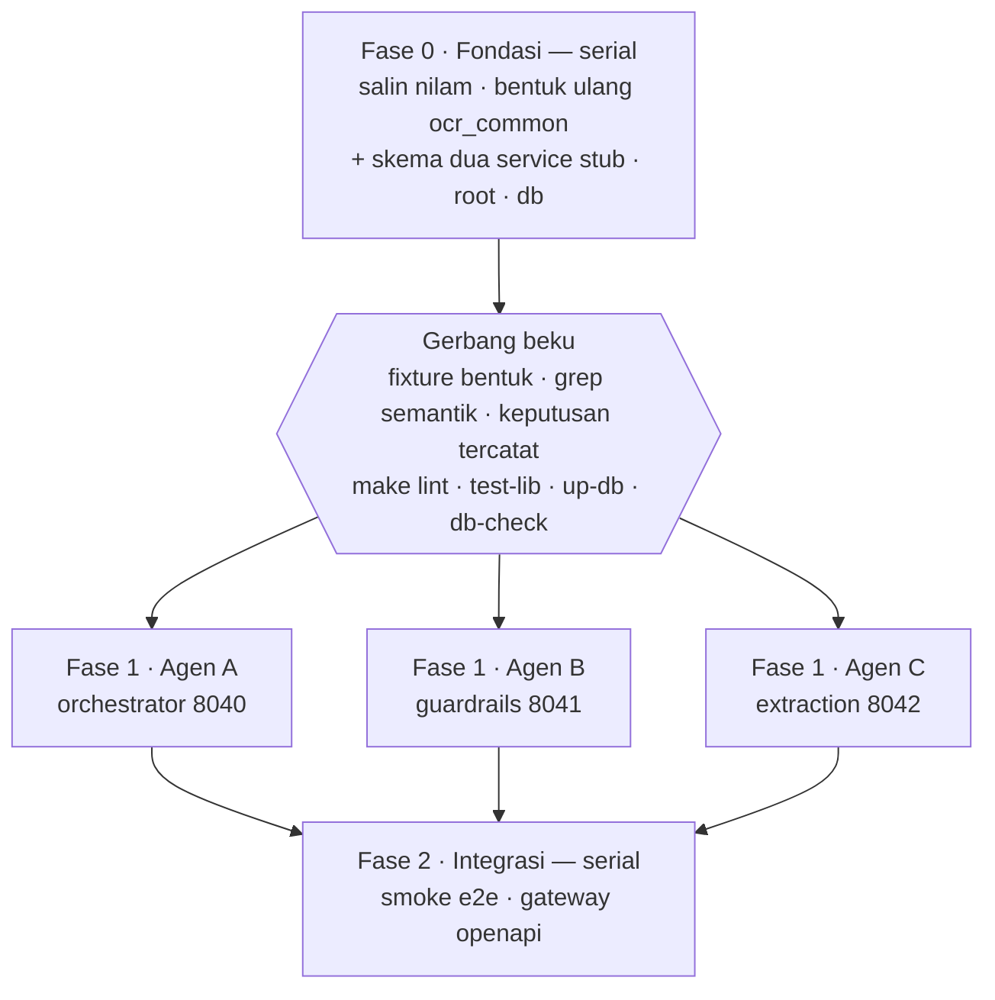

# nlm-k2: Orchestrator, Guardrails, dan Extraction

## Problem Frame

`nlm-k2` (OCR Kartu Keluarga) akan dibangun mengikuti struktur `nilam-ocr-npwp`.
Kontraknya sudah beku di [`api-contract.md`](../../api-contract.md) draf 9: lima service
di port 8040–8044, pipeline asinkron dengan outbox transaksional, dan tabel outcome
milik Orkestrasi pusat.

Kode lama yang tersedia (`K2Orchestrator`, `K2Quality`, `K2Extractor`) berbentuk service
mandiri bergaya lama — envelope sendiri, logging sendiri, database sendiri. Yang dipakai
dari sana hanya **inti modelnya**; seluruh lapis web diganti punya nilam.

Batch pertama mengerjakan orchestrator, guardrails, dan extraction dengan tiga agen paralel.
Hambatan utamanya bukan ketiga service itu, melainkan **apa yang mereka bagi**:
`libs/ocr_common` (42 modul) dan lapis akar (`Makefile`, `pyproject.toml`,
`docker-compose.yml`, `db/migrations/`). Tidak satu pun dimiliki oleh salah satu agen.
Kalau ketiganya mulai dari nol berbarengan, masing-masing akan mengarang fondasinya
sendiri dan saling menimpa.

Karena itu pekerjaan dibagi tiga fase: fondasi serial, tiga agen paralel, integrasi serial.

## Alur Pengerjaan

Yang membuat fase paralel benar-benar paralel adalah kontrak yang sudah dipaku: agen A
membangun kliennya dari §5 dan §6, bukan dari kode agen B dan C.

## Requirements

**Fondasi — serial, sebelum fase paralel**

- R1. `nlm-k2` berisi salinan penuh struktur `nilam-ocr-npwp` (akar, `libs/`, `services/`,
  `db/`, `deploy/`, `scripts/`, `api/`, `.github/`), disunting di tempat. `api-contract.md`
  pindah ke `docs/`. Catatan: nilam tidak punya `.env.example` yang di-commit — compose-nya
  memakai `env_file: services/<svc>/.env` per service — jadi berkas itu ditulis baru di fase 0.
- R2. Fase 0 **mengubah bentuk** empat modul `ocr_common`, bukan sekadar menamainya ulang.
  Inventarisnya eksplisit karena inilah yang dibekukan R22:
  - `npwp.py` → `kk.py`: `DOCUMENT_TYPE = "kk"`, `contract_fields()` menghasilkan sembilan field
    §3.3 termasuk daftar `anggota_keluarga`, `final_result()` menerima bentuk §7.3 yang datar.
    `NPWP_FIELDS` pecah jadi dua konstanta — 11 nama field dokumen dan 15 nama field anggota
    (§7.3) — plus daftar sembilan nama field kontrak §3.3.1; `TRUST_SCORES` digantikan bentuk
    `FieldConfidences` yang baru; `REJECTED_CODE` tetap.
  - `types.py`: `OcrBlock` jadi `{text, score, poly}` dan `BoundingBox` dibuang (§10 memakai
    poligon 4 titik, bukan kotak tegak); `StructuredDocument` kehilangan pembungkus `fields`
    serta `flag`/`flag_reason`, dan tiap field membawa `ocr_conf` + `crf_conf` menggantikan
    `confidence` tunggal; `ContractData` memuat dua field dokumen + `anggota_keluarga` bertipe
    daftar, sehingga `ContractField` bukan lagi satu-satunya tipe daun; `FieldConfidences` jadi
    2 skor dokumen + 7 skor per anggota.
  - `pipeline/schemas.py`: kembaran Pydantic dari semua perubahan di atas, plus
    `GuardrailsDocument` memperoleh `probability_bad`/`threshold_used` dan kehilangan
    `n_pages`/`n_approve`/`n_reject`; `GuardrailsResult.pages` dibuang.
  - `pipeline/callbacks.py`: `RESULT_FIELDS`, `_NAME_FIELDS`, dan pemetaan `probability` ditulis
    ulang untuk larik anggota bersarang.

  Modul `ocr_common` selebihnya hanya berubah istilah. Suite `libs/ocr_common/tests/` — 16 berkas,
  ~2.440 baris yang assertion-nya dibangun di atas bentuk NPWP — ikut ditulis ulang di fase 0 dan
  dihitung sebagai bagian dari biayanya.
- R3. Port, nama image, dan nama container jadi 8040–8044 dan `nlm-k2-<service>`, konsisten
  di `Makefile`, `docker-compose.yml`, `.env.example`, `deploy/`, dan
  `.github/workflows/ci.yml` (yang menuliskan kelima port dan nama database secara harfiah).
- R4. nlm-k2 memakai satu database PostgreSQL sendiri (mis. `bribrain_ocr_kk`) yang
  **dibagi dengan Orkestrasi pusat**, persis pola nilam dengan `bribrain_ocr_nilam`: tabel
  tahap milik repo ini, tabel `orchestration_*` milik mereka, di database yang sama sehingga
  penulisan outcome tetap satu transaksi dengan penyimpanan hasil. Ini **bukan** replika —
  ini tabel outcome yang sesungguhnya untuk pipeline KK. Tabel versi Alembic dinamai
  `ocr_kk_alembic_version`, dan filter `include_object` di `db/migrations/env.py` disalin apa
  adanya karena itulah yang membuat tabel milik orkestrasi bisa hidup berdampingan tanpa
  di-drop autogenerate.
- R4a. Database itu berada di **instans PostgreSQL tersendiri**, bukan instans yang dipakai nilam.
  Dua alasan: PII Kartu Keluarga tidak masuk ke instans yang daftar aksesnya disusun untuk NPWP,
  dan matriks hibah R28 baru bisa ditegakkan di instans yang tidak punya peran lintas-database
  milik tim lain — di instans bersama, hibah per tabel hanyalah hiasan.
- R5. Migrasi Alembic dimulai dari satu baseline baru yang langsung membentuk keadaan akhir
  skema, bukan menyalin tujuh revisi nilam yang sebagiannya justru membongkar desain lama.
  Baseline ditulis **setelah** keputusan R34 (pertahankan-atau-buang) dan R27 (bentuk tabel
  audit) tercatat, karena keduanya menentukan isinya dan `db/**` beku setelah R6.
- R6. Fondasi dinyatakan beku hanya bila **kelimanya** hijau:
  - **Kesesuaian bentuk**: fixture emas untuk §5.2, §7.3, §8.3, dan proyeksi §3.3.1 divalidasi
    oleh tipe dan skema Pydantic yang baru — termasuk **model respons milik service** structuring
    dan scoring, bukan hanya `ocr_common`, karena model service-lah yang otoritatif di batas HTTP.
  - **Periksa semantik** lewat `make check-npwp` (`scripts/check_no_npwp.py`), yang **berlingkup**.
    Gerbang ini memisahkan fase 0 dari fase 1, jadi ia hanya menuntut kebersihan atas apa yang fase 0
    miliki: lapis akar, `libs/`, `db/`, `deploy/`, `.github/`, `api/`, dan kedua service stub. Ketiga
    service agen dibersihkan agennya masing-masing di fase 1 dan diperiksa definisi selesai R24;
    `smoke_e2e.py` dan pembangun gateway milik Unit 10. *Versi pertama requirement ini menuntut
    bersih repo-wide sebelum fase 1 — syarat yang tidak mungkin dipenuhi, karena justru fase 1 yang
    membersihkan ketiga service itu.* Ditambah pemeriksaan nilai: `application/pdf` tidak ada di
    `allowed_content_types` bawaan sehingga PDF dijawab 400 sesuai §3.5, `max_upload_bytes` 5 MB
    sesuai §13.1, dan jalur multi-halaman mati kecuali env R34a dinyalakan.
  - **Keputusan tercatat** di `db/README.md` atau ADR di `docs/`: pertahankan-atau-buang R34,
    bentuk tabel audit R27, matriks peran dan retensi R28. Gerbang tidak hijau kalau salah
    satunya masih terbuka, karena R5 dan R22 membekukan hasilnya.
  - `make lint`, `python -m ruff format --check .`, dan `make test-lib`.
  - `make up-db`, `make db-upgrade`, `make db-external`, dan `make db-check` terhadap Postgres
    sungguhan. `make up` saja tidak menyalakan database, sehingga tidak menguji apa pun yang
    dibekukan fase 0.

**Stub structuring dan scoring — dibangun di fase 0**

- R7. Kedua service mewarisi **arsitektur** web-nya dari salinan R1 — endpoint job, tabel,
  serah-terima outbox, penulisan tabel outcome tidak dibangun ulang — tetapi bentuk NPWP-nya
  tidak hanya ada di `ocr_common`, jadi lapis non-`ml` ikut ditulis ulang:
  `services/structuring/app/api/schemas.py` (buang `BoundingBox` lokal dan `TextLine.bbox/page`;
  `StructuredDocument` jadi bentuk datar §7.3), `services/structuring/app/services/structuring_service.py`,
  `services/scoring/app/api/schemas.py` (§8.3), dan `services/scoring/app/services/*.py`.
  `services/structuring/app/ml/{npwp_rules,rule_based}.py` beserta `app/vendor/npwp_rules/**`
  dihapus. Kode `ml/` yang benar-benar baru hanya `app/ml/mock.py` di masing-masing. Cangkang
  service tetap berubah seperlunya sesuai R7a, R8, R8a, dan R27.
- R7a. Tiga kewajiban kontrak berada di cangkang service, bukan di lapis `ml/`: (a) endpoint job
  structuring **tidak** mewarisi `min_length=1` pada `texts`, karena gambar kosong harus sampai
  ke aturan untuk ditolak di sana (§7.1); (b) structuring menerima kedua bentuk serah-terima,
  termasuk badan tanpa blok `ocr` saat `PIPELINE_HANDOFF_BY_REFERENCE` menyala; (c) stub scoring
  merakit `result_data` dengan memanggil `contract_fields()` dari `ocr_common/kk.py` — fungsi yang
  sama persis yang dipakai orchestrator — dan `field_confidence_threshold` tetap satu definisi di
  `ocr_common/config.py`, tanpa override per service di compose.
- R7b. Stub tidak boleh bernilai tetap, karena perbedaan struktural terbesar KK terhadap NPWP
  justru panjang `anggota_keluarga` yang berubah-ubah. Jumlah anggota dapat dikendalikan dan skor
  tiap anggota berbeda-beda, sehingga salah-selaras indeks antara larik anggota structuring dan
  larik skor scoring terdeteksi sekarang. **Nol anggota adalah kasus penolakan** §7.4 aturan
  ketiga, bukan 200 dengan larik kosong — dan justru itu yang diuji; kasus 200 memakai jumlah
  anggota ≥ 1 yang berbeda dari fiksi bawaan.
- R7c. Seluruh nilai di `ml/mock.py`, fixture emas R6, dan smoke test R25 **dibangkitkan**: NIK
  sintetis yang lolos bentuk tetapi tidak merujuk orang nyata, dan nama fiktif. Tidak pernah
  disalin dari kartu sungguhan; aturan pembangkitnya ditulis sekali di fase 0.
- R8. Penolakan stub structuring memakai **aturan §7.4 yang sesungguhnya**, bukan kanal simulasi
  baru. Mock extraction menghasilkan `ocr.texts` kosong — dipicu hook nama berkas di tahap
  extraction, yang di sana memang masih punya nama berkas — dan stub structuring menerapkan aturan
  pertama §7.4, "tidak ada kotak teks sama sekali" → `reject_reason`. Tidak ada mekanisme baru
  yang mendarat di `ocr_common`, dan jalur yang diuji adalah jalur yang akan dipakai aturan KK
  sungguhan.
- R8a. Setiap hook simulasi, `GUARDRAILS_SKIP_ALLOWED`, dan `TESTING_ENDPOINTS` mati secara
  bawaan dan menolak menyala di luar `ENVIRONMENT=local`, digerbangi di lapis config, bukan di
  tempat pemanggilan. Nama berkas adalah masukan yang dikuasai pemanggil.

**Orchestrator — agen A, port 8040**

- R9. `POST /v1/extract-ocr` dan `GET /v1/extract-ocr/{request_id}` sesuai §3 dan §4, termasuk
  matriks hasil §3.2 yang disuntikkan ke OpenAPI seperti `_CONTRACT_TABLE` di nilam.
- R10. Alur submit: cek berkas → guardrails §5 → serah ke extraction §6 → tunggu sisa
  `PIPELINE_WAIT_SECONDS` → 200 bila pipeline selesai, 202 bila belum.
- R11. Orchestrator tidak menyentuh database sama sekali. Status tahap dibaca lewat
  `GET /v1/<tahap>/jobs/{request_id}` (§9), sesuai pola nilam.
- R12. Penolakan dibaca dari `reject_reason` di dalam muatan hasil structuring; hook `rejection`
  hanya membacanya. Ini yang membuat orchestrator tanpa state bisa menjawab 400.

**Guardrails — agen B, port 8041**

- R13. `POST /v1/guardrails/check` sesuai §5: selalu menjawab 200, vonis ada di `data.passed`,
  dan seluruh blok `data` diteruskan apa adanya ke extraction.
- R14. Backend dipilih lewat `GUARDRAILS_BACKEND`: `mock`, dan backend asli yang memuat blur CNN +
  XGBoost + kalibrasi dari `K2Quality/models/`. Hanya inti model yang diambil; API, envelope,
  middleware, dan lapis database K2Quality dibuang. Backend `remote` nilam dipertahankan atau
  dibuang bersamaan dengan keputusan yang sama di extraction (R18), tidak sendiri-sendiri.
- R14a. Kontrak §5.2 mewajibkan 200 dan §5.3 hanya mengenal tak-terjangkau dan timeout, sementara
  inti model K2Quality melempar `ImageValidationError`/`ImageLoadError` di 20+ tempat untuk gambar
  yang tidak bisa didekode atau berdimensi di luar rentang. Bagaimana guardrails menjawab keadaan
  "tidak bisa dinilai" ditetapkan di fase 0, karena R2 membekukan `GuardrailsDocument` yang saat
  ini tidak punya representasi untuk itu.
- R15. Ambang mengikuti pola `RejectThreshold` nilam: override per-request → sumber jarak jauh →
  env → nilai di checkpoint → 0.5. Ambang berbasis database dan `PUT /config` milik K2Quality
  dibuang. `threshold_used` di §5.2 melaporkan yang menang.
- R16. Bobot model diambil lewat `scripts/fetch_weights.py`, tidak ikut di-commit. Script itu
  kini hanya menangani satu berkas per model, sementara K2Quality butuh enam artefak dan
  K2Extractor dua `.pth`, jadi ia diperluas di fase 0 agar R16 tidak menuntut suntingan belakangan.

**Extraction — agen C, port 8042**

- R17. `POST /v1/extraction/jobs` (asinkron, 202) sesuai §6 dan `GET /v1/extraction/jobs/{request_id}`
  sesuai §9. Tidak ada endpoint extraction sinkron: §11 mendaftarkannya untuk structuring dan
  scoring saja.
- R18. Backend `mock` dan backend asli. Deskripsi backend asli diselesaikan sebelum agen C mulai:
  `ocr_backends.py` K2Extractor mengirim **dua** backend dan yang *default* justru PaddleOCR
  native, sementara jalur torch adalah `fullpytorch` yang harus dipilih — dan keduanya
  mengembalikan tipe Python yang berbeda. `ppocrv5_conversion.py` sendiri memanggil `import paddle`
  karena tugasnya mengonversi checkpoint Paddle menjadi `.pth`, jadi ia alat luring dan tidak masuk
  image service. Versi juga perlu disamakan: K2Extractor PP-OCRv5, kontrak menulis PP-OCRv6.
- R18a. Pengunduhan `file_url` tunduk pada `FILE_URL_ALLOWED_HOSTS` di orchestrator, extraction, dan
  guardrails (saat `GUARDRAILS_FETCH_URL=true`). Daftar kosong berarti **menolak semua**, bukan
  "hanya alamat publik" seperti §13.1 saat ini; ketiga service menolak start di luar
  `ENVIRONMENT=local` bila daftarnya kosong. Skema dibatasi `https`, redirect tidak diikuti, dan
  alamat hasil resolusi DNS yang jatuh di rentang privat/loopback/link-local ditolak meski
  host-nya terdaftar. Selisih semantik dengan §13.1 dicatat sebagai catatan terbuka kontrak.
- R18b. Orientasi dan pelurusan punya penanggung jawab yang disebutkan. Kontrak menghapus service
  orientasi dan rectifier dengan alasan PaddleOCR menanganinya, dan §7.1 menjanjikan `poly` pada
  gambar yang **sudah** diluruskan — sementara jalur torch det+rec menyetel `use_angle_cls = False`
  dan tidak membawa pelurusan dokumen. Kegagalannya sistematis dan baru terlihat di batch
  berikutnya, karena structuring masih stub.
- R19. Hasil OCR berbentuk `{text, score, poly}` dan diserahkan ke structuring lewat outbox
  dalam satu transaksi bersama penulisan hasil, bukan panggilan langsung.
- R20. Backend `mock` selesai dan lulus uji **lebih dulu** daripada backend asli — berlaku untuk
  agen C **dan** agen B. Mock guardrails punya pemicu penolakan deterministik (pola nama berkas,
  seperti `blur`/`invalid` di nilam) karena R25 bergantung padanya.
- R20a. Batch dinyatakan selesai dengan backend `mock`. Kedua backend asli adalah sasaran dalam
  batch ini tetapi **bukan** syarat selesai agen, karena keduanya masih memikul pertanyaan
  penelitian terbuka. Konsekuensinya diakui, bukan disembunyikan: bentuk bersama yang dibekukan
  fase 0 hanya diuji oleh mock yang dibangun dari kontrak, yaitu dari asumsi yang sama dengan
  yang dibekukan. Kalau R18/R18b berakhir buruk, R22b dipakai dan biaya fase 0 dibayar dua kali.

**Paralelisasi dan batas kepemilikan**

- R21. Setiap agen hanya menulis di direktori servicenya: A di `services/orchestrator/**`,
  B di `services/guardrails/**`, C di `services/extraction/**`.
- R22. Setelah gerbang R6, `libs/ocr_common/**` (termasuk `tests/`), `Makefile`,
  `docker-compose.yml`, `pyproject.toml`, dan `db/**` beku. Agar pembekuan itu tidak menghalangi
  R24, fase 0 **menyediakan lebih dulu** setiap kunci env compose dan aturan `lock-<service>` yang
  akan dibutuhkan ketiga service — §13 kontrak sudah mendaftarkannya, dan `lock-extraction` dipecah
  dari aturan pola bersamanya agar bisa memuat indeks PyTorch yang kini hanya ada di
  `lock-guardrails`.
- R22a. Ada kategori ketiga di luar "milik agen" dan "beku", dimiliki integrator sepanjang batch
  dan hanya berubah lewat prosedur R22b: `scripts/**`, `.github/**`, `api/**`, dokumen akar,
  **`services/structuring/**`, `services/scoring/**`**, `.env.example`, dan `docker-compose.db.yml`.
  Kedua service stub dibangun di fase 0 tetapi dipakai ketiga agen di fase 1, jadi tanpa pemilik
  mereka persis jenis berkas yang disunting dua agen di hari yang sama.
- R22b. Prosedur membuka beku ada: bentuk laporan, siapa yang memutuskan, kewajiban menjalankan
  ulang gerbang R6 sesudahnya, dan titik sinkronisasi tempat dua agen lain menyerap perubahan.
- R23. `api-contract.md` adalah satu-satunya sumber kebenaran kontrak. Tidak ada agen yang
  menyimpulkan kontrak dari kode agen lain.
- R24. Definisi selesai sama untuk ketiganya, mengikuti gerbang CI yang memang sudah dijalankan
  nilam: `make test-<service>`, `make typecheck-<service>`, `make lint`, dan
  `python -m ruff format --check .` hijau; `make lock-<service>` diregenerasi dan di-commit
  sehingga `make lock-check` lolos; `openapi.yaml` diregenerasi; service naik di compose dengan
  `/health` dan `/ready` hijau. Perubahan yang menyentuh `db/` juga wajib `make db-check`.
  Tiga tambahan: `lock-check` harus **gagal nyaring** bila git tidak tersedia, bukan lolos diam
  (`test -z` pada stdout kosong dari git yang error akan lolos); sebuah pemeriksaan `.env.example`
  yang menegaskan tiap service menolak start dengan placeholder (R29); dan satu uji per service
  yang menjalankan jalur suksesnya dengan `caplog` lalu menegaskan tidak ada nilai field maupun
  baris OCR yang muncul di catatan (R30).
- R33. Fase 0 dan fase 2 punya pelaksana yang disebut namanya — integrator — dengan definisi
  selesainya sendiri, yaitu gerbang R6 untuk fase 0 dan R25–R26 untuk fase 2. Ini aktor keempat
  di luar tiga agen service.
- R34. Subsistem warisan yang tidak punya padanan di kontrak diputus pertahankan-atau-buang di
  fase 0, karena mengikat baseline R5 dan spesifikasi gateway R26: jalur callback
  (`ORCHESTRATION_URL`, `ResultCallback`), tabel kedua `ocr.orchestration_api_events`, tabel
  `testing_*` beserta kembaran endpoint `-test`, serta Elastic APM bersama rate limit dan CORS.
- R34a. Jalur PDF **dipertahankan di belakang env**, mati secara bawaan. Kodenya tersebar di
  `app/services/pages.py` (guardrails) dan di **orchestrator** `app/config.py:max_document_pages`
  + `app/services/document_checks.py` yang mengimpor `fitz`; PyMuPDF karenanya tetap di
  `services/orchestrator/requirements.txt` dan `lock-orchestrator`. Tiga syarat menyertainya,
  karena ini satu-satunya jalur parser yang dipertahankan tanpa dipakai: (a) perilaku bawaan
  tetap 400 untuk PDF sesuai §3.5, dan itulah yang diuji R25; (b) saklarnya digerbangi di lapis
  config seperti R8a, bukan di tempat pemanggilan; (c) ada satu uji yang menjalankan jalur itu
  dengan env menyala, supaya kode yang dipertahankan tidak menjadi kode mati yang tak teruji.
  Selisih dengan §12 kontrak — yang menyatakan PDF ditolak tanpa syarat — dicatat sebagai
  catatan terbuka kontrak.

**Integrasi — serial, setelah ketiga agen selesai**

- R25. `scripts/smoke_e2e.py` disesuaikan untuk KK dan lulus, mencakup tujuh jalur: 200 dengan
  sembilan field §3.3, 400 §3.5 dari guardrails, 400 dari `ocr.texts` kosong (§7.4 aturan pertama),
  400 dari nol anggota (§7.4 aturan ketiga), 202 saat pipeline melampaui `PIPELINE_WAIT_SECONDS`
  (hook `delay…s` nilam), 422, dan satu handoff mati yang menandai tabel outcome `failed`.
- R25a. Smoke test hanya berjalan terhadap Postgres compose lokal dengan DDL tiruan
  `db/external/`, menolak jalan bila `ENVIRONMENT != local`, memakai kunci API khusus tes, dan
  membersihkan baris sampah (dead letter, failed) di akhir.
- R26. `make openapi-gateway` menghasilkan `api/gateway.openapi.yaml` gabungan yang konsisten
  dengan kelima `openapi.yaml`. Konsumennya disebutkan; kalau belum ada, R26 ditunda ke batch
  yang membutuhkannya.

**Keamanan dan data**

- R27. Kewajiban §8.5 — enkripsi Fernet, blind index atas `nomor_kk`, audit *fail-closed* —
  ditunda, tetapi penundaannya tidak boleh diam-diam sampai ke produksi. Selama audit belum
  diimplementasikan, scoring menolak start di luar `ENVIRONMENT=local` **tanpa syarat**,
  digerbangi flag eksplisit (`PII_AUDIT_IMPLEMENTED`, bawaan `false`) yang hanya boleh dibalik
  oleh batch yang benar-benar menulis audit terenkripsi. Keberadaan `PII_ENCRYPTION_KEY` tidak
  pernah menjadi bukti bahwa enkripsi ada — sebuah string berbentuk Fernet di Secret produksi
  akan memuaskan pemeriksaan semacam itu tanpa satu byte pun terenkripsi. Transaksi penutup
  scoring **akan** berubah saat audit masuk, jadi klaim "penggantinya tidak menyentuh apa pun"
  hanya berlaku untuk orchestrator.
- R28. Matriks hak per tabel ditulis bersama baseline R5, mencakup **dua sisi**: peran ketiga
  tahap nlm-k2 (hak seminimal mungkin, tanpa DDL), dan peran Orkestrasi pusat di database yang
  sama — tanpa `SELECT` pada `ocr_*`, `structuring_*`, `scoring_*`, dan `pipeline_outbox`, karena
  satu-satunya yang mereka butuhkan adalah tabel outcome. Inventaris sensitifnya: `ocr_results`
  (teks OCR seluruh kartu), `structuring_results` (26 field internal), `result_data` (sembilan
  field kontrak berisi NIK), dan `ocr_jobs.input` yang memuat presigned URL — kredensial pembawa
  ke gambar KK itu sendiri, yang harus dikosongkan setelah job `DONE`/`FAILED` dan tidak pernah
  muncul di log maupun di respons §9. Kebijakan retensi digantung pada kolom `ds`.
- R29. `.env.example` hanya memuat placeholder yang jelas tidak sah, dan tiap service menolak start
  di luar `ENVIRONMENT=local` dengan API key bawaan atau placeholder, diperiksa lewat gerbang baru
  di R24. Satu kunci saat ini mengizinkan submit **dan** `GET /v1/<tahap>/jobs/{request_id}` yang
  mengembalikan 26 field lengkap, jadi diputuskan pula apakah permukaan operasional
  (`outbox/release`, pembacaan job) memerlukan kunci terpisah.
- R30. Logging tidak pernah memuat teks OCR maupun nilai field — hanya jumlah, skor, dan
  `request_id`; `error_message` job dan `last_error` outbox dibersihkan dari isi muatan.
  Pembersihan outbox/job diuji di `make test-lib`; klaim tentang kode service diuji per service
  lewat gerbang `caplog` di R24, karena `make test-lib` secara struktural tidak melihat
  `services/`. Kalau APM dipertahankan (R34), body capture dimatikan dan span tidak membawa nilai
  field.
- R31. Penjaga commit menolak fixture gambar **dan** pola 16 digit NIK di berkas teks/JSON. Bila
  validasi backend asli nanti menuntut kartu sungguhan, berkasnya hidup di luar repo di jalur yang
  di-`gitignore`, dirujuk lewat env, dan dihapus setelah batch.
- R32. `scripts/fetch_weights.py` memverifikasi digest SHA-256 dari manifes yang di-commit sebelum
  bobot dipakai, dan cara ia memperoleh kredensial GCS dinyatakan (workload identity / ADC, bukan
  kunci yang di-commit). Digest saja tidak cukup — ia membuktikan berkasnya yang itu, bukan bahwa
  isinya jinak — jadi setiap `torch.load` memakai `weights_only=True`, atau bobot disimpan ulang
  sebagai safetensors di tahap konversi luring. `PaddleOCR2Pytorch` dipatok ke commit yang sudah
  ditinjau bila jadi di-vendor.

## Success Criteria

- Satu gambar KK melewati kelima service dan menghasilkan 200 sesuai §3.3, dengan dua tahap
  terakhir masih stub dan ketiga service memakai backend `mock`.
- Ketiga jalur penolakan menghasilkan 400: guardrails (sinkron), `ocr.texts` kosong, dan nol
  anggota — dua terakhir lewat `reject_reason` aturan §7.4.
- Sebuah KK dengan jumlah anggota (≥ 1) berbeda dari fiksi bawaan tetap menghasilkan
  `data.anggota_keluarga` sepanjang itu, dengan confidence yang benar-benar milik tiap anggota.
- Keadaan akhir setiap request muncul di tabel outcome, termasuk saat handoff jadi dead letter.
- Ketiga agen berjalan berbarengan tanpa pernah menyunting berkas yang sama.
- Fixture bentuk §5.2/§7.3/§8.3/§3.3.1 divalidasi tipe `ocr_common` **dan** model respons service,
  dan periksa semantik R6 bersih.

## Scope Boundaries

- Aturan structuring KK yang sebenarnya (port `K2Regex-v2`) dan trust model scoring beserta
  kalibrasi isotoniknya **bukan** bagian batch ini — keduanya stub.
- Tidak ada pengecekan kualitas crop, konsisten dengan draf 9.
- Enkripsi PII dan blind index §8.5 ditunda dengan syarat R27, bukan dihapus.
- Tidak ada Helm chart baru maupun kegiatan deploy, tetapi `deploy/` dan `.github/` tetap harus
  lolos gerbang R6; aturan hapus-versus-sunting untuk keduanya ditetapkan di fase 0.
- `K2Orchestrator`, `K2Quality`, dan `K2Extractor` hanya dibaca, tidak diubah.
- `tools/tracker` dan `tools/load-tester` tidak ikut disalin.

## Key Decisions

- **Fondasi serial dulu, baru paralel**: ketiga service berbagi `ocr_common` dan lapis akar yang
  tidak dimiliki siapa pun. Membekukannya lebih dulu mengubah paralelisasi dari sumber konflik
  menjadi aman. Biayanya nyata dan bukan "fase pendek": R2 membentuk ulang empat modul plus
  menulis ulang ~2.440 baris uji, R7 menulis ulang lapis non-`ml` dua service, dan lima keputusan
  desain harus tercatat sebelum gerbang. Fase 0 lebih besar dari salah satu agen paralel.
- **Salin utuh lalu sunting**, bukan port modul per modul: paling setia pada struktur nilam dan
  jauh lebih cepat. `grep` saja tidak cukup sebagai gerbang, karena asumsi NPWP yang paling
  berbahaya tidak membawa token itu — karena itu R6 menambahkan fixture bentuk, periksa semantik,
  dan keputusan tercatat.
- **Stub tipis untuk structuring dan scoring**, bukan berhenti di extraction: seluruh siklus
  202→200, outbox, tabel outcome, dan ketiga jalur penolakan bisa diuji sekarang.
- **Penolakan stub memakai aturan §7.4, bukan kanal simulasi baru**: `ocr.texts` kosong sudah
  merupakan pemicu di dalam kontrak yang bertahan melewati lompatan JSON, logikanya hidup di
  `mock.py` yang memang kode baru, dan yang diuji adalah jalur yang akan dipakai aturan KK
  sungguhan.
- **Satu database sendiri, dibagi dengan Orkestrasi pusat**, persis pola nilam dengan
  `bribrain_ocr_nilam`: tabel tahap milik repo ini dan tabel `orchestration_*` milik mereka hidup
  berdampingan, sehingga penulisan outcome tetap satu transaksi dengan penyimpanan hasil.
- **Hanya inti model yang diambil dari K2Quality dan K2Extractor**: lapis web nilam-lah yang jadi
  tujuan porting ini. Untuk K2Quality klaim ini sudah diperiksa dan bertahan —
  `quality_service.py` mengimpor `src.core.config.settings` tetapi tidak pernah memakainya,
  `database_service` hanya dijangkau dari `routes.py`/`main.py`, dan `threshold_provider.py`
  berdiri sendiri lalu dibuang oleh R15. Yang ikut terbawa: jalur PDF (`fitz`), wadah `Models`,
  dan — ini yang penting — `src.core.exceptions`, rezim validasi kedua yang ditangani R14a. Untuk
  K2Extractor klaim ini **belum** diperiksa setara, dan R18 sudah menunjukkan deskripsinya meleset.
- **`mock` menutup batch, backend asli tidak memblokirnya** (R20a), dengan konsekuensinya diakui
  di requirement itu sendiri.

## Dependencies / Assumptions

- Bobot `K2Quality/models/` (enam artefak) dan `.pth` K2Extractor (dua berkas) tersedia, lokal
  atau lewat GCS, dengan digest yang bisa diverifikasi (R32).
- Instans PostgreSQL tersendiri disediakan untuk nlm-k2 (R4a) — satu instans Cloud SQL baru, bukan
  hanya satu database baru di instans nilam. Ini prasyarat penyediaan yang perlu diajukan lebih
  dulu karena baseline R5 ditulis di atasnya.
- Orkestrasi pusat belum siap dipanggil, jadi pengembangan memakai DDL tiruan tabel outcome di
  `db/external/`. R4 karenanya keputusan sepihak: menyediakan database kedua adalah wewenang
  mereka, dan seseorang perlu ditunjuk untuk membicarakannya sebelum baseline R5 ditulis.
- `api-contract.md` draf 9 tidak berubah selama batch ini berjalan. Catatan terbuka kontrak yang
  masih bisa bergerak — terutama nama dan kolom tabel outcome — didaftar beserta requirement yang
  terpengaruh.

## Outstanding Questions

### Resolve Before Planning

_Kosong._ Ketiga pemblokir sudah ditutup saat review:

- **Instans PostgreSQL** — instans tersendiri, bukan berbagi dengan nilam. Lihat R4a.
- **Jalur PDF** — dipertahankan di belakang env, mati secara bawaan. Lihat R34a untuk ketiga
  syaratnya, termasuk kewajiban satu uji yang menjalankan jalur itu dengan env menyala supaya ia
  tidak jadi kode mati.
- **Repo git** — `nlm-k2` di-init sebagai repo git di awal fase 0. Tanpa git, `make lock-check`
  lolos secara semu (`test -z` pada stdout kosong dari git yang error) dan definisi selesai R24
  tidak bisa ditegakkan sejak hari pertama. Worktree terpisah versus direktori terpisah ditunda
  ke perencanaan.

### Deferred to Planning

- [Affects R5, R34] Cakupan baseline setelah keputusan pertahankan-atau-buang R34, khususnya
  tabel `testing_*` dan bentuk tabel audit R27.
- [Affects R15][Technical] Nama env ambang guardrails — kontrak §13.3 memakai
  `GUARDRAILS_THRESHOLD`, nilam memakai `GUARDRAILS_REJECT_THRESHOLD` — dan apakah tingkat
  sumber jarak jauh dipertahankan sama sekali, mengingat ia tidak punya konsumen di kontrak KK.
- [Affects R14a][Technical] Bentuk jawaban guardrails untuk gambar yang tidak bisa dinilai.
- [Affects R18][Needs research] Ukuran dan sumber bobot `.pth`, apakah backend asli memakai
  `fullpytorch` atau PaddleOCR native, dan apakah `PaddleOCR2Pytorch` perlu di-vendor.
- [Affects R18b][Needs research] Siapa yang melakukan orientasi dan pelurusan pada jalur torch.
- [Affects R14][Technical] Apakah wadah `Models` ikut di-port, dan berapa besar tambahan
  dependensi (xgboost, opencv, scipy) terhadap image guardrails yang sudah memuat torch.
- [Affects R28][Technical] Apakah Orkestrasi pusat terhubung dengan peran yang bisa dibatasi
  nlm-k2, atau dengan peran pemilik yang tidak bisa — ini menentukan apakah matriks R28 bisa
  ditegakkan di baseline atau harus jadi kesepakatan lintas tim.
- [Affects R28][User decision] Isi minimum `result_data` yang benar-benar dibutuhkan Orkestrasi
  pusat. Posisi bawaan nlm-k2: sembilan field kontrak saja, penambahan harus dibenarkan tertulis.
  Enkripsi R27 tidak akan pernah menjangkau tabel ini karena skemanya milik mereka.
- [Affects R14, R18] Apakah backend `remote` dipertahankan di kedua service atau dibuang di
  keduanya.
- [Affects R31] Apakah validasi backend asli boleh memakai gambar KK sungguhan. Tidak memblokir:
  R20a menyatakan backend asli bukan syarat selesai, dan bagian R31 yang tanpa biaya berlaku
  tanpa menunggu jawaban.

## Next Steps

→ Selesaikan tiga pertanyaan `Resolve Before Planning`, lalu `/ce:plan`.
