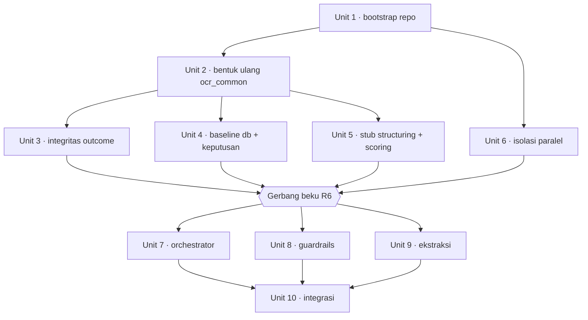

# feat: nlm-k2 orchestrator, guardrails, dan ekstraksi

## Overview

Membangun `nlm-k2` — pipeline OCR Kartu Keluarga — sebagai salinan-dan-adaptasi dari
`nilam-ocr-npwp`. Lima service FastAPI di port 8040–8044 berbagi `libs/ocr_common`. Batch ini
mengerjakan orchestrator, guardrails, dan ekstraksi dengan tiga agen paralel; structuring dan
scoring hadir sebagai stub supaya seluruh siklus 202→200 bisa diuji.

Pekerjaan dibagi tiga fase: fondasi serial oleh integrator, tiga agen paralel, integrasi serial.
Yang membuat fase paralel aman adalah kontrak yang sudah beku (§5 dan §6 memaku klien agen A) dan
gerbang beku R6 yang memisahkan fase 0 dari fase 1.

Riset perencanaan mengubah tiga hal secara material terhadap dokumen asal:

| Temuan | Akibat pada rencana |
|---|---|
| Tipe kontainer OCR (`OcrEngineResult`, `OcrResult`, `OcrPayload`) dan `config.py` memuat bentuk/perilaku NPWP tetapi tidak ada di inventaris R2 | Unit 2 diperluas; tanpa ini agen C menabrak tipe beku pada hari pertama |
| Baris outcome bisa mundur dari `completed` ke `422/failed` lewat dead letter relay atau eksekusi kembar | Unit 3 baru — satu-satunya celah yang bisa merusak data yang dibaca tim lain |
| `make lock-check`, `make lint`, dan `make up-db` semuanya lingkup-repo, menulis berkas milik pemilik lain | Unit 6 baru; tanpa ini R21 dan R24 saling bertentangan dan ketiga agen saling memblokir |

## Problem Frame

Kode lama (`K2Orchestrator`, `K2Quality`, `K2Extractor`) berbentuk service mandiri bergaya lama —
envelope sendiri, logging sendiri, database sendiri. Yang diambil hanya inti modelnya; seluruh
lapis web diganti punya nilam, yang sudah membawa envelope bersama, korelasi `request_id`, outbox
transaksional, dan tabel outcome.

Hambatan utamanya bukan ketiga service, melainkan apa yang mereka bagi: `libs/ocr_common` (42 modul)
dan lapis akar. Tidak satu pun dimiliki salah satu agen (see origin: `docs/brainstorms/2026-09-26-nlm-k2-tiga-service-pertama-requirements.md`).

## Requirements Trace

Dokumen asal memuat 47 requirement (R1–R34a). Rencana ini memetakannya ke sepuluh unit; setiap unit
menyebut requirement yang dimajukannya. Kriteria sukses yang harus dipenuhi di akhir batch:

- Satu gambar KK melewati kelima service dan menghasilkan 200 sesuai §3.3, dua tahap terakhir stub,
  ketiga service memakai backend `mock`.
- Ketiga jalur penolakan menghasilkan 400: guardrails, `ocr.texts` kosong, dan nol anggota.
- KK dengan jumlah anggota (≥ 1) berbeda dari fiksi bawaan menghasilkan `data.anggota_keluarga`
  sepanjang itu dengan confidence milik tiap anggota.
- Keadaan akhir setiap request muncul di tabel outcome, termasuk saat handoff jadi dead letter.
- Ketiga agen berjalan berbarengan tanpa menyunting berkas yang sama.

## Scope Boundaries

- Aturan structuring KK sungguhan (port `K2Regex-v2`) dan trust model scoring: stub.
- Backend ML asli guardrails dan ekstraksi: sasaran, bukan syarat selesai (origin R20a).
- Enkripsi PII §8.5 ditunda dengan pagar R27.
- Tidak ada deploy; `deploy/` dan `.github/` tetap lolos gerbang R6.
- `tools/tracker` dan `tools/load-tester` tidak disalin.

## Context & Research

### Perakitan satu tahap — kontrak yang harus dipenuhi

`libs/ocr_common/ocr_common/pipeline/factory.py` adalah satu-satunya modul yang dibutuhkan
composition root sebuah tahap. Sebuah service memperoleh klaim-dalam-transaksi, eksekusi latar,
hasil+outcome+outbox dalam satu transaksi, relay outbox, dan reaper job basi dengan menyediakan
lima hal: konstanta `stage`, `table_prefix`, factory coroutine `Work`, opsional pembangun
`HandoffPayload` + nama `next_stage`, dan `resume(request_id, input)`.

Contoh kerja: `services/ekstraksi/app/dependencies.py` dan
`services/ekstraksi/app/services/job_service.py`.

`build_stage_pipeline(settings, *, stage, table_prefix, next_stage=None, testing=False)` membangun
`SqlOutbox` (hanya bila `PIPELINE_OUTBOX` **dan** `DATABASE_URL`), repository job, dan penulis
outcome. `testing=True` memberi prefiks `testing_` ke setiap tabel, menekan callback dan baris
outcome, serta melabeli ulang metrik.

### Mesin keadaan yang diwarisi

Dari `pipeline/stage.py` + `pipeline/repository_sql.py`:

- `claim()` = `INSERT … ON CONFLICT DO NOTHING`, jika gagal maka
  `UPDATE … WHERE status=FAILED OR (status=PROCESSING AND updated_at < now - lease)`. Hanya pada
  klaim yang berhasil, `outcome.claimed()` meng-upsert `202/processing/<stage>`.
- Status job hanya `PROCESSING | DONE | FAILED`. Penolakan adalah `DONE` + `result.reject_reason`.
- `complete()` menulis `<stage>_results` + job `DONE` + outcome + baris outbox dalam **satu**
  transaksi.
- `StaleJobReaper` (`PIPELINE_STALE_JOBS`, bawaan **true**) mengklaim baris `PROCESSING` yang lebih
  tua dari lease, memanggil `outcome.claimed()`, lalu `resume()`.
- `OutboxRelay` mengulang pada 5xx dengan backoff `×2` sampai umur melewati
  `PIPELINE_OUTBOX_MAX_AGE_SECONDS`; **4xx langsung jadi dead letter**. `_give_up` →
  `handoff_failed()` → outcome `422/failed/<tahap berikutnya>_FAILED`.
- `PipelineWaiter.wait()` menyurvei tahap berurutan, memperlakukan 404 dan `PROCESSING` sama.

### Bentuk NPWP yang hidup di luar `ocr_common`

Tiga berkas memuat bentuk NPWP di lapis non-`ml` service stub, sehingga "mewarisi apa adanya"
mustahil — service-nya bahkan tidak akan mengimpor setelah `ocr_common` dibentuk ulang:

| Berkas | Isi NPWP |
|---|---|
| `services/structuring/app/api/schemas.py` | `BoundingBox` lokal, `TextLine(bbox, page)`, `StructuredDocument{fields, flag, flag_reason}`, `document_type` bawaan `"npwp"`, `lines` dengan `min_length=1` |
| `services/structuring/app/services/structuring_service.py` | membangun `{document_type, fields, flag, flag_reason, reject_reason}` |
| `services/scoring/app/api/schemas.py` | `npwp`, `npwp_score`, `npwp_candidate_count`, `name_base` |

Ditambah `services/structuring/app/ml/{npwp_rules,rule_based}.py` dan `app/vendor/npwp_rules/**`
yang dihapus, serta `services/scoring/app/services/job_service.py` yang memanggil
`contract_fields`/`final_result` langsung.

### Proyeksi kontrak sudah tunggal

`contract_fields()` ada satu kali di `ocr_common/npwp.py` dan dipanggil dua tempat:
`services/orchestrator/app/api/extract_contract.py:65` dan
`services/scoring/app/services/job_service.py:49,64`. Ambangnya juga tunggal:
`ocr_common/config.py:43 field_confidence_threshold`. Keduanya dibekukan R22, jadi tidak ada dua
implementasi yang bisa menyimpang — asalkan fase 0 tidak menambahkan override per service di compose.

### Institutional learnings

`docs/solutions/` tidak ada di repo mana pun, jadi tidak ada learning terdokumentasi untuk ditarik.
Memori sesi yang relevan dan sudah diperiksa: baseline parser layout KK (korpus 1184 dokumen) dan
kalibrasi confidence (CRF conf ≠ P(benar), AUC 0.525; fusi+isotonic menurunkan ECE ke 0.019 dengan
plafon 96%). Keduanya menyangkut structuring dan scoring sungguhan, yang **di luar lingkup batch
ini** — dicatat agar batch berikutnya tidak mengulang eksperimennya.

### Riset eksternal

Dilewati. Pola lokalnya kuat: lima service nilam berbentuk persis ini sudah berjalan, jadi
dokumentasi FastAPI/SQLAlchemy/Alembic umum tidak menambah apa pun yang tidak bisa dibaca dari
repo. Domain berisiko tinggi di batch ini (PII) ditangani dengan menunda, bukan mengimplementasikan.

## Key Technical Decisions

- **Inventaris R2 diperluas ke tipe kontainer dan `config.py`.** `OcrEngineResult{blocks, model}`
  dan `OcrResult{engine, elapsed_ms, full_text}` harus jadi `texts` + `text_regions_count` +
  `avg_doc_score` + `min_doc_score`, tanpa `full_text`. `config.py` bukan "hanya berubah istilah":
  bawaannya memuat `application/pdf` dan 2,5 MB, dan sembilan kewajiban config-layer dari dokumen
  asal mendarat di sana. Tanpa perluasan ini gerbang beku menutup di atas fondasi yang tidak bisa
  membawa data KK. `full_text` dibuang karena **redundan** — tidak ada yang mengonsumsinya dan
  `texts[]` yang otoritatif; ini bukan pengurangan PII, karena `texts[]` membawa setiap baris kartu
  dan sudah terdaftar sebagai sensitif di R28. Posisi PII untuk muatan OCR bersandar pada R28, R30,
  dan R27 yang ditunda, bukan pada penghapusan ini.
- **Baris outcome dibuat monoton dan job berdetak.** `claimed()` berhenti menulis `result_data`,
  upsert dijaga agar tidak menurunkan `completed`, dan job memperbarui `updated_at` selama berjalan.
  Alternatif "naikkan saja `PIPELINE_JOB_LEASE_SECONDS`" ditolak: ia menggeser ambang tanpa
  menghapus kelasnya, dan kartu 200+ kotak dengan model dingin bisa melewati ambang mana pun.
- **Isolasi paralel disediakan sebelum beku, bukan dikecualikan sesudahnya.** `make lock-check`
  meregenerasi kelima lock dan memeriksa `services/*/requirements.lock db/requirements.lock`,
  `make lint` berjalan lintas repo, dan `make up-db` menyalakan kelima container di port tetap. Jadi
  R24 seperti tertulis mustahil dipenuhi tanpa melanggar R21. Fase 0 menambahkan
  `lock-check-<service>`, lint berlingkup pohon, dan nama proyek compose + offset port per agen —
  semuanya di `Makefile`/`docker-compose.yml` yang dibekukan, jadi harus mendahului gerbang.
- **Tiap agen bekerja di git worktree sendiri.** Ini yang membuat lint dan compose berlingkup pohon
  punya arti, dan menutup celah `lock-check` yang lolos semu di luar repo git.
- **Larik anggota selaras posisional; structuring otoritatif atas panjangnya.** Scoring wajib
  mengembalikan larik sepanjang yang diterimanya; ketidakcocokan panjang adalah kegagalan scoring
  (422 `SCORING_FAILED`), bukan dipotong atau ditambal diam-diam. Kontrak tidak menyatakan ini dan
  R7b tidak bisa mendeteksi salah-selaras tanpa perilaku benar untuk dibandingkan.
- **Guardrails menjawab "tidak bisa dinilai" sebagai vonis, bukan galat** (R14a). `verdict`
  memperoleh nilai ketiga `"unassessable"`, `probability_bad: null`, `passed: false`, dengan
  `reason` berbahasa Indonesia tersendiri. Ini mempertahankan §5.2 (selalu 200) dan tetap bisa
  dibedakan dari penolakan kualitas. Inti model K2Quality melempar
  `ImageValidationError`/`ImageLoadError` di 20+ tempat, jadi jalur ini bukan jalur eksotis.
- **`PIPELINE_HANDOFF_BY_REFERENCE=true`** untuk batch ini, sesuai anjuran §13.2 dan catatan
  terbuka #6: kartu KK menghasilkan 200+ kotak, dan mode ini menjaga muatan itu keluar dari baris
  outbox — termasuk dead letter, yang relevan untuk R30.
- **Penolakan stub memakai aturan §7.4 sungguhan**, bukan kanal simulasi baru (origin R8).

## High-Level Technical Design

> *Ini menggambarkan pendekatan yang dimaksud dan merupakan panduan arah untuk ditinjau, bukan
> spesifikasi implementasi. Agen pelaksana memperlakukannya sebagai konteks, bukan kode untuk
> disalin.*

Perbaikan integritas baris outcome (Unit 3), sebagai aturan bukan kode:

```
kolom per pemanggil, bukan satu aturan global:
    claimed()   -> status_code, downstream_status, downstream_stage
    completed() -> ketiganya + result_data, dan NULL-kan error_code/error_message
    failed()    -> ketiganya + error_code/error_message, result_data tidak disentuh
    rejected()  -> sama seperti failed()

write(...):
    upsert ON CONFLICT (request_id) DO UPDATE
        SET <kolom pemanggil ini saja>
        WHERE existing.downstream_status <> 'completed'
              OR incoming.downstream_status = 'completed'
    kalau WHERE menekan penulisan -> WARNING + counter(request_id, stage, incoming_status)

selama job berjalan, sebagai task yang dimulai dan DIBATALKAN DI 'finally' oleh _run_bound:
    setiap PIPELINE_HEARTBEAT_SECONDS: repository.touch(request_id)
                                       -> UPDATE <stage>_jobs SET updated_at = now()
                                          WHERE request_id = ? AND status = PROCESSING
    setelah PIPELINE_JOB_MAX_RUNTIME_SECONDS: gagalkan, apa pun isi updated_at
```

Tiga sifat yang dihasilkan: baris `completed` tidak bisa dimundurkan oleh dead letter relay maupun
eksekusi kembar, job yang sah-berjalan-lama tidak terlihat basi, dan job yang macet tetap punya
batas atas sehingga tetap mencapai keadaan akhir.

## Implementation Units



### Fase 0 — integrator, serial

- [x] **Unit 1: Bootstrap repo dan penamaan** — selesai, 4 commit

**Goal:** `nlm-k2` menjadi repo git berisi salinan struktur nilam dengan port, nama image, dan nama
container KK.

**Requirements:** R1, R3, R4a

**Dependencies:** Instans PostgreSQL terpisah sudah diajukan (prasyarat penyediaan, R4a).

**Files:**
- Create: `.git/` (via `git init` — tanpa ini `make lock-check` lolos semu dan R24 tak bisa ditegakkan)
- ~~Create: `services/*/.env.example`~~ — terverifikasi saat pelaksanaan: nilam **memang**
  meng-commit kelimanya, jadi berkas itu ikut tersalin dan tidak perlu ditulis baru
- Create: `.gitattributes` dengan `* text=auto eol=lf`. Milik nilam hanya mencakup `*.sh`,
  sementara `core.autocrlf=true` adalah bawaan Git for Windows — tanpa ini checkout berikutnya
  menulis CRLF ke working tree, dan working tree itulah build context Docker
- Modify: `Makefile`, `docker-compose.yml`, `docker-compose.db.yml`, `pyproject.toml`,
  `.github/workflows/ci.yml`, `deploy/helm/**`, seluruh `services/*/Dockerfile`
- Modify: `services/guardrails/Dockerfile` — ia memaku asumsi satu artefak di dua tempat
  (`RUN test -f weights/best_model.pt` dan `GUARDRAILS_MODEL_PATH=weights/best_model.pt`), dan
  `ci.yml` punya langkah `touch services/guardrails/weights/best_model.pt`. Keduanya
  digeneralisasi jadi "direktori tidak kosong" **sekarang**, karena K2Quality butuh enam artefak.
  Koreksi saat pelaksanaan: Dockerfile-nya ada di `services/guardrails/**` sehingga milik agen B
  dan **tidak** beku — yang beku baginya hanyalah `ci.yml` (R22a). Keduanya harus cocok, jadi
  keduanya tetap diselesaikan di sini
- Move: `api-contract.md` → `docs/api-contract.md`
- Delete-and-restub: `README.md` (92 KB, 48 sebutan NPWP) dan `integration.md` (29 KB, 41 sebutan)
  diganti README KK yang pendek; `api/gateway.openapi.yaml` dan `api/index.html` diregenerasi di
  Unit 10. Tanpa keputusan ini uji `grep -ri npwp` Unit 1 tidak bisa dipenuhi, dan 120 KB dokumentasi
  operator NPWP jadi pekerjaan fase 0 yang tak teranggarkan
- Modify: `docs/api-contract.md` → **draf 10**. Rencana ini memperkenalkan tiga perilaku yang
  dibantah kontrak beku: nilai `verdict` ketiga `"unassessable"` (§5.2, §10 kini hanya
  `accepted | reject`), `FILE_URL_ALLOWED_HOSTS` kosong yang menolak semua (§13.1 mengatakan "hanya
  alamat publik"), dan saklar PDF yang tidak ada di §13. Mencatatnya hanya sebagai catatan terbuka
  akan membuat **dua** sumber kebenaran kontrak, padahal R23 mensyaratkan satu — dan agen A yang
  patuh pada R23 akan menulis model respons guardrails yang tidak menerima `unassessable`
  sementara agen B mengirimkannya, dengan kegagalannya baru muncul di fase 2 yang serial

**Approach:**
- Salin `nilam-ocr-npwp` utuh kecuali `tools/`, lalu sunting di tempat.
- `.github/workflows/ci.yml` menuliskan kelima port dan nama database secara harfiah — ia ikut
  disunting, bukan hanya Makefile dan compose.
- Tetapkan aturan hapus-versus-sunting untuk `deploy/` dan `.github/` sekarang, karena gerbang R6
  berlaku atas keduanya meski batch ini tidak deploy.

**Patterns to follow:** struktur direktori `nilam-ocr-npwp` apa adanya. Kelima `Dockerfile` adalah
berkas sembilan langkah yang sama dan **membawa digest `python:3.11-slim` yang identik** — komentarnya
menyebut perintah penyegarannya dan aturan bahwa kelimanya harus tetap sama; jaga sifat itu saat
menyalin.

**Test scenarios:**
- Happy path: `make lint` dan `python -m ruff format --check .` hijau pada pohon hasil salinan.
- Happy path: `git status` bersih setelah commit awal; `make lock-check` dijalankan di dalam repo
  git dan benar-benar memeriksa, bukan lolos karena stdout kosong.
- Edge case: `grep -i npwp` bersih **dalam lingkup Unit 1** — `Makefile`, kedua compose,
  `pyproject.toml`, `.github/`, `deploy/`, `api/`, `scripts/build_gateway_openapi.py`, dan
  `services/*/Dockerfile`. Bersih repo-wide adalah syarat gerbang R6, bukan syarat unit ini:
  `libs/` milik Unit 2, kedua service stub milik Unit 5, `smoke_e2e.py` milik Unit 10, dan nama
  tabel Alembic di `ci.yml` milik Unit 4.
- Edge case: seluruh berkas teks ber-LF setelah checkout, apa pun `core.autocrlf` mesin pengembang.

**Verification:** Pohon repo berdiri, kelima service ter-build, dan penamaan konsisten di keenam
tempat yang menuliskannya.

---

- [x] **Unit 2: Bentuk ulang `ocr_common` untuk KK** — selesai (2a+2b bentuk/impor/penamaan, 2c kebijakan config)

**Goal:** Pustaka bersama membawa bentuk KK, bukan NPWP, dan suite ujinya membuktikannya.

**Requirements:** R2, dan prasyarat bagi R6 butir pertama

**Dependencies:** Unit 1

**Files:**
- Create: `libs/ocr_common/ocr_common/kk.py`
- Delete: `libs/ocr_common/ocr_common/npwp.py`
- Modify: `libs/ocr_common/ocr_common/types.py`, `pipeline/schemas.py`, `pipeline/callbacks.py`,
  `config.py`, `image_validation.py`, `clients/fetch_url.py`
- Modify (**tukar impor, wajib atau `ocr_common` tidak akan mengimpor sama sekali**):
  `pipeline/outcomes.py:13` dan `pipeline/stage.py:13` keduanya mengimpor dari `ocr_common.npwp`
  yang dihapus di unit ini. Perubahan perilakunya tetap di Unit 3; di sini hanya impornya.
- Modify (agar `grep -ri npwp` Unit 1 bisa lolos): `web/app.py` (memaku
  `RELEASE = "nilam-ocr-npwp"` dan prosa NPWP di deskripsi OpenAPI), `testing.py`
  (`image_upload(filename="npwp.jpg")`), `simulation.py`, `__init__.py`
- Modify: `web/intake.py` — tidak memuat token `npwp` dan tidak tercakup periksa semantik, tetapi
  dua deskripsi field-nya diimpor setiap endpoint keempat service dan karenanya mendarat di setiap
  `openapi.yaml` yang diregenerasi R24 dan digabung R26. Ia mengiklankan
  `Document image (JPEG/PNG/PDF)` padahal §3.1 menolak PDF, dan menyatakan host `file_url` boleh
  "resolve to a public address when that is empty" — persis semantik yang dibalik R18a
- Test: `libs/ocr_common/tests/**`. **Koreksi estimasi, terukur saat pelaksanaan:** suitenya memang
  16 berkas / ~2.440 baris, tetapi hanya **lima uji** yang benar-benar menegaskan bentuk NPWP —
  `test_outcomes`, `test_api_events`, `test_result_callback` ×2, dan `test_gateway_spec` yang
  sebenarnya cuma butuh artefak Unit 10. Sisanya menguji mesin pipeline yang netral dokumen dan
  lolos tanpa perubahan logika; yang berubah hanya muatan contohnya. Hasil akhir: 229 lolos,
  1 di-skip. Perkiraan "tulis ulang seluruh suite" meleset jauh ke arah yang menguntungkan, jadi
  fase 0 lebih kecil daripada yang ditaksir Key Decisions.
- Create: `libs/ocr_common/tests/fixtures/` — fixture emas §5.2, §6.1/§7.1, §7.3, §8.3, §3.3.1

**Approach:**
- `kk.py`: `DOCUMENT_TYPE = "kk"`, `contract_fields()` menghasilkan sembilan field §3.3 termasuk
  daftar `anggota_keluarga`, `final_result()` menerima bentuk §7.3 yang datar. `NPWP_FIELDS` pecah
  jadi dua konstanta (11 nama field dokumen, 15 nama field anggota) plus daftar sembilan nama field
  kontrak §3.3.1. `TRUST_SCORES` digantikan bentuk `FieldConfidences` baru. `REJECTED_CODE` tetap.
- `types.py`: `OcrBlock` → `{text, score, poly}`, `BoundingBox` dibuang; **kontainernya juga** —
  `OcrEngineResult`/`OcrResult` kehilangan `blocks` dan `full_text`, memperoleh `texts`,
  `text_regions_count`, `avg_doc_score`, `min_doc_score`. `StructuredDocument` kehilangan pembungkus
  `fields`, `flag`, `flag_reason`; `StructuringResult` kehilangan `document_type`; `FinalResult`
  kehilangan `flag`/`flag_reason`; `ScoringResult` memperoleh `model`; tiap field membawa
  `ocr_conf` + `crf_conf`; `ContractData` memuat dua field dokumen + `anggota_keluarga` bertipe
  daftar; `FieldConfidences` jadi 2 skor dokumen + **larik** skor per anggota yang selaras
  posisional dengan larik anggota structuring — itulah yang membuat aturan `SCORING_FAILED` bisa
  ditegakkan. **`ContractField.value` menjadi `str`, bukan `str | None`**: §3.3 menyatakan field
  yang tidak ditemukan adalah `{"value": "", "confidence": 0}` dan objeknya "tidak pernah null".
  nilam mengembalikan `None`, jadi membekukan bentuk nilam berarti membekukan bentuk yang dilarang
  kontrak — diwarisi ketiga agen, `result_data`, dan Orkestrasi pusat sekaligus.
- `pipeline/schemas.py`: kembaran Pydantic dari semua perubahan itu, plus `GuardrailsDocument`
  memperoleh `probability_bad`, `threshold_used`, dan nilai `verdict` ketiga `"unassessable"`;
  kehilangan `n_pages`/`n_approve`/`n_reject`; `GuardrailsResult.pages` dibuang.
- `pipeline/callbacks.py`: `RESULT_FIELDS`, `_NAME_FIELDS`, pemetaan `probability` ditulis ulang
  untuk larik anggota bersarang.
- `config.py`: `allowed_content_types` tanpa `application/pdf`, `max_upload_bytes` 5 MB, gerbang
  config-layer untuk hook simulasi/`GUARDRAILS_SKIP_ALLOWED`/`TESTING_ENDPOINTS` (R8a), kebijakan
  `FILE_URL_ALLOWED_HOSTS` tolak-semua (R18a), `PII_AUDIT_IMPLEMENTED` (R27), penolakan API key
  placeholder (R29), saklar PDF (R34a).
- `clients/fetch_url.py`: https-only, tanpa redirect, tolak alamat privat/loopback/link-local
  setelah resolusi DNS.
  **Diperketat saat pelaksanaan:** `address_allowed()` lama berakhir dengan
  `ip.is_global or bool(allowed_hosts)`, sehingga begitu ada allow-list, alamat privat RFC1918
  lolos. Itu disengaja agar object store di dalam cluster terjangkau, tetapi digabung entri
  wildcard (`.internal`) ia jadi lubang: penguasa DNS di bawah sufiks itu bisa mengarahkan nama
  ke alamat internal mana pun. Alamat privat kini hanya untuk host yang terdaftar **persis**.

**Execution note:** Tulis fixture emas lebih dulu sebagai uji yang gagal, lalu bentuk tipenya sampai
fixture lolos. Fixture inilah gerbang R6 butir pertama, jadi ia artefak, bukan alat bantu.

**Spike wajib sebelum membekukan §7.1.** Dari kelima bentuk yang dibekukan, §7.1 adalah satu-satunya
yang **belum pernah dikeluarkan sistem mana pun**. §7.3 ditranskripsi dari `data.ocr_result`
K2Regex-v2 yang nyata, §8.3 belum ada apa-apa, tetapi §7.1 ditulis pada versi yang belum dijalankan:
§12 mencatat K2Extractor mengeluarkan `[[poly,[text,score]]]` di PP-OCRv5 sementara kontrak menulis
`{text, score, poly}` di PP-OCRv6. Membekukannya dari contoh kontrak saja berarti memvalidasi sebuah
aspirasi dengan mock yang ditulis dari aspirasi yang sama. Bukti penyangkalnya murah: jalankan jalur
`fullpytorch` K2Extractor **satu kali** atas satu gambar contoh, catat bentuk keluaran harfiahnya,
pastikan `poly` benar 4×2 pada bingkai yang sudah diluruskan, dan bangun fixture §7.1 dari
pengamatan itu.

**Spike sudah dijalankan** (26 Sep 2026) — hasilnya di
[`docs/decisions/2026-09-26-spike-bentuk-ocr-71.md`](../decisions/2026-09-26-spike-bentuk-ocr-71.md).
Ringkas: backend mengeluarkan `[{rec_texts, rec_scores, rec_polys}]`, `poly` benar 4×2 tetapi
bertipe **float32** dan berupa segiempat **miring** — sehingga membuang `BoundingBox` bukan hanya
boleh, melainkan perlu. Kemiringan itu juga **mengonfirmasi R18b**: koordinatnya ada di bingkai
gambar asli, tidak diluruskan, jadi janji §7.1 tidak dipenuhi backend ini. Satu KK menghasilkan
177 kotak, yang membenarkan `PIPELINE_HANDOFF_BY_REFERENCE=true`. Fixture §7.1 dibangun dari
pengamatan ini, bukan dari contoh kontrak.

**Patterns to follow:** `ocr_common/npwp.py` sebagai bentuk modul; `pipeline/schemas.py` sebagai
kembaran Pydantic dari `types.py`.

**Test scenarios:**
- Happy path: fixture §7.3 (datar, 11 kunci dokumen + `anggota_keluarga` × 15 field, dua skor per
  field) divalidasi skema Pydantic yang baru.
- Happy path: fixture §6.1/§7.1 dengan `texts`/`text_regions_count`/`avg_doc_score`/`min_doc_score`
  divalidasi; muatan yang masih memakai `blocks` atau `full_text` ditolak.
- Happy path: `contract_fields()` atas fixture §8.3 dengan 4 anggota menghasilkan sembilan field
  §3.3 dengan `anggota_keluarga` sepanjang 4.
- Edge case: `contract_fields()` dengan `anggota_keluarga: []` menghasilkan larik kosong, bukan galat.
- Edge case: panjang larik anggota scoring ≠ structuring → galat yang bisa dibedakan, bukan
  pemotongan diam-diam.
- Edge case: field tanpa nilai menghasilkan `{"value": "", "confidence": 0}` — **tidak pernah**
  `null`, dan kedua kunci dokumen serta ketujuh kunci tiap anggota selalu ada (§3.3).
- Error path: `allowed_content_types` bawaan menolak `application/pdf`.
- Error path: `FILE_URL_ALLOWED_HOSTS` kosong menolak setiap `file_url`; host terdaftar yang
  me-resolve ke 127.0.0.1 atau 169.254.0.0/16 ditolak; skema `http` ditolak; redirect tidak diikuti.
- Error path: API key placeholder menolak start saat `ENVIRONMENT != local`.

**Verification:** `make test-lib` dan `make typecheck-lib` hijau; tidak ada simbol bernama NPWP yang
tersisa; setiap fixture emas lolos.

---

- [x] **Unit 3: Integritas baris outcome dan detak job** — selesai

**Goal:** Baris outcome tidak pernah mundur, dan job yang sah-berjalan-lama tidak dianggap basi.

**Requirements:** Mengisi celah yang tidak dimiliki requirement mana pun di dokumen asal; melindungi
kriteria sukses "keadaan akhir setiap request muncul di tabel outcome".

**Dependencies:** Unit 2

**Files:**
- Modify: `libs/ocr_common/ocr_common/pipeline/outcomes.py`, `pipeline/repository_sql.py`,
  `pipeline/repository.py` (Protocol `JobRepository` + `InMemoryJobRepository`, yang dipakai setiap
  jalur uji tanpa `DATABASE_URL`), `pipeline/factory.py` (tempat interval detak diteruskan),
  `pipeline/stage.py`, `pipeline/reaper.py`, `pipeline/tables.py`, `config.py`
- Test: `libs/ocr_common/tests/test_outcomes.py`, `tests/test_reaper.py`, `tests/test_outbox.py`

**Approach:**

**Koreksi atas analisis awal rencana ini.** Jalur yang semula disebut — reaper mengklaim ulang lalu
`claimed()` menimpa baris `completed` — **tidak bisa dicapai**. `reclaim_stale` hanya memilih
`status == STATUS_PROCESSING`, dan `complete()` menyetel job jadi `DONE` di transaksi yang sama
dengan penulisan baris `completed`, jadi reaper tidak akan pernah melihatnya. Dua jalur yang
**benar-benar** bisa dicapai:

1. Relay outbox menyerah melewati `PIPELINE_OUTBOX_MAX_AGE_SECONDS` → `handoff_failed()` →
   `outcome.failed()` menulis `422/<TAHAP>_FAILED` di atas baris yang sudah `completed` oleh tahap
   berikutnya.
2. Eksekusi kembar yang ditinggalkan `resume()` terdahulu memanggil `fail()` setelah eksekusi asli
   memanggil `complete()`.

Akibatnya **upsert monotonlah yang menanggung beban**, dan ia harus mencakup `failed()`,
`rejected()`, dan `handoff_failed()` — bukan hanya `claimed()`. Perbaikan `claimed()` tetap
dikerjakan sebagai pertahanan berlapis, bukan sebagai judulnya.

- Aturan kolom ditetapkan **per pemanggil**, bukan satu aturan global. Hari ini `_write` selalu
  menyertakan `error_code`, `error_message`, dan `result_data`, sehingga penulisan berikutnya
  membersihkan yang sebelumnya. Kalau itu diganti "hanya kolom yang diberikan pemanggil",
  pembersihannya hilang — dan `claim()` bisa mengklaim ulang baris `FAILED`, sehingga urutan
  fail → klaim ulang → sukses menghasilkan `200/completed` yang **masih membawa**
  `error_code = SCORING_FAILED`. Jadi: `claimed()` menulis tiga kolom status saja; `completed()`
  menulis itu plus `result_data` dan secara eksplisit meng-NULL-kan kedua kolom galat;
  `failed()`/`rejected()` menulis kolom galat dan tidak menyentuh `result_data`.
- Penekanan penulisan oleh penjaga monotonisitas **tidak boleh senyap**: ia mengeluarkan WARNING dan
  menaikkan counter dengan `request_id`, tahap, dan status yang datang. Tanpa itu, balapan yang unit
  ini perbaiki jadi tak terlihat di produksi — dan justru pengukuran itulah yang memberi tahu apakah
  detaknya bekerja. Perubahan semantik penulisan ini juga masuk daftar yang disepakati dengan
  Orkestrasi pusat, bukan sekadar keputusan sepihak nlm-k2, karena tabelnya milik mereka.
- Detak **dipasang tetapi dimatikan bawaannya** (`PIPELINE_HEARTBEAT_SECONDS = 0`). Reviewer benar
  bahwa intervalnya dirancang melawan durasi yang belum diukur, dan batch ini tidak bisa melatihnya:
  mock selesai dalam milidetik, dan hook `delay…s` dibatasi 120 detik melawan lease 300 detik. Tetapi
  `repository.py`, `stage.py`, dan `factory.py` beku setelah gerbang R6, jadi menambahkan `touch()`
  belakangan berarti satu siklus R22b. Mekanismenya ada, angkanya tidak dikarang — batch yang
  menjalankan model sungguhan tinggal menyetelnya. `JobRepository` memperoleh `touch(request_id)`
  yang memperbarui `updated_at` hanya `WHERE status = PROCESSING`, dijalankan sebagai task yang
  `StagePipeline._run_bound` mulai dan **batalkan di `finally`** — detak yang hidup lebih lama dari
  job yang dibatalkan akan menjaga lease job mati tetap hangat dan melumpuhkan reaper sepenuhnya.
  Intervalnya diteruskan dari `build_stage_pipeline`.
- Detak menghapus satu-satunya batas atas umur job, jadi ia diganti yang eksplisit:
  `PIPELINE_JOB_MAX_RUNTIME_SECONDS`, setelahnya job digagalkan dengan kode galat yang bisa
  dibedakan **terlepas dari `updated_at`**. Tanpa ini, job yang macet tetapi prosesnya hidup akan
  berdetak selamanya, tidak pernah dipanen, dan tidak pernah menulis keadaan akhir — menukar bug
  korupsi data dengan bug liveness, dan diam-diam melemahkan kriteria sukses batch ini.
- Detak berjalan di event loop, jadi ia hanya berdetak kalau `work()` melepaskan loop. Itu berlaku
  hari ini karena setiap backend ekstraksi nilam adalah klien HTTP, tetapi Unit 9 menggantinya
  dengan model dalam proses — lihat catatan di Unit 9.

**Execution note:** Mulai dari uji regresi yang gagal, digerakkan lewat jalur dead letter relay —
bukan lewat reaper, yang tidak bisa mencapai keadaannya.

**Patterns to follow:** `pipeline/repository_sql.py:79,100,127,153` sebagai tempat `updated_at`
sudah ditulis hari ini.

**Test scenarios:**
- Happy path: urutan normal `claimed` → `completed` menghasilkan `200/completed/<data>`.
- Happy path: `failed()` lalu `completed()` untuk `request_id` yang sama menghasilkan
  `200/completed` dengan `error_code IS NULL` — pembersihan kolom galat tidak boleh hilang saat
  aturan kolom dipersempit per pemanggil.
- Edge case: `handoff_failed()` setelah tahap berikutnya sudah `completed` **tidak** mengubah baris
  jadi `422/failed`, dan menaikkan counter penekanan serta menulis WARNING.
- Edge case: `fail()` dari eksekusi kembar setelah eksekusi asli `complete()` — sama.
- Edge case: `claimed()` setelah `completed()` tidak mengubah status maupun mengosongkan
  `result_data` (pertahanan berlapis; jalur ini tidak bisa dicapai lewat reaper).
- Edge case: job yang berjalan melewati lease tetapi berdetak tidak diambil `reclaim_stale`.
- Edge case: job yang benar-benar terlantar (tanpa detak, melewati lease) tetap diambil dan
  `resume()` tetap terpanggil — perbaikan ini tidak boleh mematikan reaper.
- Edge case: job yang berdetak melewati `PIPELINE_JOB_MAX_RUNTIME_SECONDS` tetap mencapai keadaan
  akhir dengan kode galat yang bisa dibedakan.
- Edge case: task detak dibatalkan saat job dibatalkan — tidak ada detak yang hidup lebih lama dari
  jobnya dan menjaga lease mati tetap hangat.
- Error path: `resume()` gagal setelah klaim ulang pada request yang sudah `completed` → baris
  outcome tetap `completed`.
- Integration: handoff yang jadi dead letter setelah tahap berikutnya selesai berakhir dengan tepat
  satu baris outcome `completed` dan `result_data` utuh.

**Verification:** Baris outcome tidak pernah beralih dari `completed` ke status lain di seluruh
suite; reaper masih memulihkan job yang benar-benar terlantar.

---

- [x] **Unit 4: Baseline database dan keputusan yang tercatat** — selesai

**Goal:** Skema KK berdiri dalam satu baseline, dan lima keputusan yang dibekukan gerbang tertulis
sebelum ditulis.

**Requirements:** R4, R5, R27, R28, R34, R34a

**Dependencies:** Unit 2 (bentuk tabel mengikuti tipe yang sudah beku)

**Files:**
- Delete: `db/migrations/versions/000{1..7}_*.py` — Unit 1 menyalin pohonnya utuh, jadi ketujuh
  revisi nilam **sudah ada**. Dibiarkan, `make db-upgrade` akan menjalankan migrasi era NPWP
  (termasuk `0007_drop_ocr_npwp_requests`) dan `make db-check` membandingkan terhadap himpunan tabel
  yang salah
- Create: `db/migrations/versions/0001_baseline.py` dengan `down_revision = None`
- Modify: `.github/workflows/ci.yml` — langkah "Adopt a database"-nya memaku
  `DROP TABLE ocr_npwp_alembic_version`, yang diganti namanya di unit ini
- Modify: `db/migrations/env.py` (`VERSION_TABLE = "ocr_kk_alembic_version"`; filter
  `include_object` disalin apa adanya — itulah yang membuat tabel milik orkestrasi tidak di-drop
  autogenerate), `db/README.md`, `db/external/*.sql`
- Create: `docs/decisions/` — catatan keputusan R14a, R27, R28, R34, R34a, mode handoff, dan aturan
  penyelarasan larik anggota

**Approach:**
- Baseline membentuk keadaan akhir **tabel pipeline** langsung. *Dipersempit saat pelaksanaan:*
  ia **tidak** memuat tabel audit R27 — bentuknya diputuskan dan dicatat, tetapi tabel kosong tanpa
  penulis tidak menghasilkan apa pun, dan bentuk yang salah sama mahalnya untuk diperbaiki seperti
  menambahkannya belakangan. Isinya: `ocr_jobs/_results`, `structuring_jobs/_results`,
  `scoring_jobs/_results`, `pipeline_outbox` + dead letter, dan — sesuai keputusan R34 — tabel
  `testing_*`. Tujuh revisi nilam tidak disalin; sebagiannya justru membongkar desain lama.
- R34 memutus pertahankan-atau-buang untuk: jalur callback, `ocr.orchestration_api_events`, tabel
  `testing_*`, serta Elastic APM bersama rate limit dan CORS. Keputusan `testing_*` mengikat isi
  baseline, jadi ia mendahului penulisannya.
- R27: bentuk tabel audit diputuskan sekarang (populasinya menyusul), dan `PII_AUDIT_IMPLEMENTED`
  bawaan `false` membuat scoring menolak start di luar `ENVIRONMENT=local`.
- R28: matriks hak dua sisi — peran ketiga tahap nlm-k2 tanpa DDL, dan peran Orkestrasi pusat tanpa
  `SELECT` pada tabel tahap. `ocr_jobs.input` memuat presigned URL, jadi ia dikosongkan di transaksi
  `complete()`/`fail()` milik job itu sendiri, bukan lewat sapuan retensi `ds`.

**Patterns to follow:** `db/migrations/env.py` nilam, khususnya `include_object` dan
`VERSION_TABLE`; `db/external/apply.py` untuk DDL tiruan.

**Test scenarios:**
- Happy path: `make db-upgrade` pada database kosong lalu `make db-check` melaporkan tidak ada
  selisih antara definisi tabel di kode dan di database.
- Happy path: `make db-external` memasang DDL tiruan, dan `make db-check` sesudahnya **tetap** tidak
  melaporkan selisih — membuktikan `include_object` benar-benar mengecualikan tabel milik orkestrasi.
- Edge case: `make db-upgrade` dijalankan dua kali idempoten.
- Edge case: `ocr_jobs.input` kosong setelah job `DONE`, dan tetap terisi selagi `PROCESSING`
  (§3.1 menjanjikan job terlantar bisa dijalankan ulang dari `input.file_url`).
- Error path: scoring menolak start dengan `ENVIRONMENT=production` dan `PII_AUDIT_IMPLEMENTED=false`.

**Verification:** Skema berdiri dari nol dalam satu perintah; keenam keputusan ada sebagai teks yang
bisa dirujuk gerbang R6.

---

- [x] **Unit 5: Stub structuring dan scoring** — selesai

**Goal:** Dua tahap terakhir menjawab dalam bentuk kontrak dengan data yang bervariasi, sehingga
seluruh siklus bisa diuji.

**Requirements:** R7, R7a, R7b, R7c, R8

**Dependencies:** Unit 2

**Files:**
- Create: `services/structuring/app/ml/mock.py`, `services/scoring/app/ml/mock.py`,
  `libs/ocr_common/ocr_common/testing/synthetic_kk.py` (pembangkit NIK sintetis dan nama fiktif)
- Modify: `services/structuring/app/api/schemas.py`,
  `services/structuring/app/services/structuring_service.py`,
  `services/scoring/app/api/schemas.py`, `services/scoring/app/services/*.py`,
  `services/*/app/dependencies.py`
- Delete: `services/structuring/app/ml/npwp_rules.py`, `app/ml/rule_based.py`,
  `app/vendor/npwp_rules/**`
- Test: `services/structuring/tests/`, `services/scoring/tests/`

**Approach:**
- Lapis web-nya arsitekturnya diwarisi, tetapi tiga berkas non-`ml` memuat bentuk NPWP dan ditulis
  ulang — tanpa itu service-nya tidak akan mengimpor setelah Unit 2.
- `min_length=1` pada `texts` dibuang **hanya pada model request job** (§7.1). Endpoint sinkron
  `/v1/ocr_postprocess` mempertahankannya: §7.1 menyatakannya boleh, dan §11 mendaftarkannya sebagai
  "dipertahankan apa adanya (`texts` tetap `min_length=1`)". Kalau keduanya berbagi satu model
  Pydantic hari ini, pisahkan — membuang batasan itu secara menyeluruh melanggar jaminan §11 yang beku.
- Stub structuring menerapkan ketiga aturan §7.4 sungguhnya, **dalam urutan** — `texts` kosong
  memenuhi ketiganya sekaligus, jadi urutanlah yang membuat jalur itu deterministik.
- Stub scoring merakit `result_data` dengan memanggil `contract_fields()` dari `kk.py`, tanpa
  override ambang per service.
- Seluruh nilai dibangkitkan, tidak disalin dari kartu sungguhan.

**Patterns to follow:** `services/ekstraksi/app/ml/mock.py` dan `ml/base.py` sebagai bentuk backend;
`services/ekstraksi/app/services/job_service.py` sebagai perakitan tahap. Structuring adalah
**satu-satunya** tahap yang menyediakan hook `rejection`, dan isinya tiga baris
(`structuring.get("reject_reason") or None`). Scoring adalah tahap terminal: tanpa `next_stage` dan
tanpa `handoff_payload`, melainkan `callback_result=final` dan
`outcome_data=lambda scoring: contract_fields(final(scoring), self._confidence_threshold)` — inilah
perkabelan R7a(c) yang harus dipertahankan; hanya badan closure `work` yang diganti.

**Urutan internal yang mengikat** (dua tepi impor yang putus lebih dulu):
1. `app/api/jobs.py` mengimpor konstanta contoh dari `app/api/<service>.py`, jadi modul sinkronnya
   ditulis ulang sebelum `jobs.py` bisa dikompilasi.
2. `services/scoring/app/services/confidence_service.py` bergantung pada bentuk
   `fields[...]["signals"]` hasil structuring, jadi keluaran stub structuring dibekukan sebelum
   pembangun muatan scoring ditulis. Inilah alasan konkret fixture emas R6 harus divalidasi model
   respons service, bukan hanya tipe `ocr_common`.
Closure `work` structuring hari ini menormalkan blok OCR menjadi `{text, confidence, bbox, page}`;
literal itulah yang menjadi `{text, score, poly}`.

**Test scenarios:**
- Happy path: muatan §7.1 dengan N kotak menghasilkan bentuk §7.3 dengan `anggota_keluarga`
  sepanjang N-yang-diminta dan skor berbeda per anggota.
- Happy path: stub scoring menghasilkan §8.3 dan `result_data` sembilan field yang identik dengan
  yang dihasilkan orchestrator dari hasil yang sama.
- Edge case: `texts: []` → `reject_reason` aturan **pertama** §7.4, meski ketiga kondisi terpenuhi.
- Edge case: `nomor_kk` valid tetapi `anggota_keluarga: []` → `reject_reason` aturan ketiga; karena
  aturan 2 dan 3 berbagi pesan yang sama, uji menegaskan lewat isi hasil (`nomor_kk` terisi,
  `anggota_keluarga` kosong), bukan lewat pesannya.
- Edge case: `nomor_kk` kosong atau `"Not found"` → `reject_reason` aturan kedua.
- Edge case: `/v1/ocr_postprocess` **tetap** menolak `texts: []` dengan 422 (§11), meski endpoint
  job menerimanya.
- Edge case: badan tanpa blok `ocr` diterima saat `PIPELINE_HANDOFF_BY_REFERENCE=true`.
- Edge case: jumlah anggota 1 dan 8 sama-sama melewati proyeksi tanpa pergeseran indeks.
- Error path: larik anggota scoring lebih pendek dari structuring → job `FAILED`, outcome
  `422/SCORING_FAILED`, bukan 200 dengan confidence milik anggota lain.
- Integration: job structuring yang ditolak berakhir `DONE` dengan `reject_reason` terbaca lewat
  `GET /v1/structuring/jobs/{request_id}`, **tanpa** handoff ke scoring, dan baris outcome
  `400/DOWNSTREAM_VALIDATION_ERROR`.

**Verification:** `make test-structuring` dan `make test-scoring` hijau; tidak ada simbol NPWP
tersisa di kedua service.

---

- [x] **Unit 6: Isolasi paralel** — selesai

**Goal:** Tiga agen bisa memenuhi definisi selesainya sendiri tanpa menulis berkas milik agen lain.

**Requirements:** R21, R22, R22a, R22b, R24, R33

**Dependencies:** Unit 1

**Files:**
- Modify: `Makefile` (`lock-check-<service>` per service; `lock-ekstraksi` dipecah dari aturan pola
  bersamanya agar bisa memuat indeks PyTorch; `lint`/`format --check` berlingkup pohon),
  `docker-compose.yml` **dan `docker-compose.db.yml`**, `services/*/.env.example`.
  Nama proyek compose saja tidak cukup: setiap service menyetel `container_name:` eksplisit, dan
  nama eksplisit tidak di-namespace oleh nama proyek — dua agen tetap bentrok pada namanya, bukan
  hanya portnya. `docker-compose.db.yml` menambah dua nama tetap lagi (`nlm-k2-postgres`,
  `nlm-k2-migrate`) plus volume bernama `postgres-data`. Jadi: buang atau parameterkan setiap
  `container_name:`, parameterkan nama volume, lalu setel `COMPOSE_PROJECT_NAME` dan offset port
  per agen
- Create: `docs/decisions/unfreeze-procedure.md`

**Approach:**
- *Koreksi saat pelaksanaan:* premis tentang `make lint` tidak berlaku. Dengan worktree per agen
  (diputuskan di Unit 1), pohon satu agen tidak memuat pekerjaan agen lain yang belum di-commit,
  jadi lint lintas-repo tidak terganggu. `LINT_PATH` tetap ditambahkan sebagai pemendek putaran,
  bukan pengganti. Yang tetap nyata adalah lock, di bawah ini.
- Hari ini `lock-check: lock` meregenerasi kelima lock lalu memeriksa
  `services/*/requirements.lock db/requirements.lock` — sehingga definisi selesai agen A menulis
  lock milik structuring, scoring, dan `db/`. Itu membuat R21 dan R24 saling bertentangan, dan
  resolusi `uv pip compile` bergantung waktu sehingga dua agen bisa menghasilkan pin transitif
  berbeda untuk service yang bukan milik keduanya.
- `make up-db` menyalakan kelima container di port dan nama tetap dengan satu volume Postgres, jadi
  tidak ada agen yang bisa memenuhi definisi selesainya tanpa menyalakan container agen lain, dan dua
  agen tidak bisa memenuhinya bersamaan di satu host. Dari ketiga agen, hanya **agen C** yang benar-benar
  terikat Postgres: orchestrator stateless tanpa `DATABASE_URL` dan `/ready`-nya sengaja tidak menyurvei
  service hilir, sementara guardrails memakai `readiness={}` sehingga `/ready`-nya selalu 200. Jadi
  isolasi ini terutama melindungi agen C, dan bagi A dan B cukup nama proyek compose yang berbeda.
- Sediakan lebih dulu setiap kunci env yang akan dibutuhkan ketiga service — §13 kontrak, **ditambah**
  delta dari dokumen asal (allowlist tolak-semua R18a, saklar PDF R34a, yang keduanya berbeda dari §13).
- Prosedur membuka beku: bentuk laporan, siapa yang memutuskan selama fase 1, permintaan yang
  bersamaan dikumpulkan dan digerbangi dengan irama yang disebutkan, apa yang dikerjakan dua agen
  lain selama gerbang berjalan, dan kewajiban agen yang sudah hijau menjalankan ulang R24 terhadap
  revisi beku yang baru.

**Test scenarios:**
- Happy path: `make lock-check-orchestrator` gagal saat `services/orchestrator/requirements.lock`
  basi, dan **tidak** menulis lock service mana pun selain orchestrator.
- Happy path: dua proyek compose dengan offset port berbeda naik bersamaan di satu host tanpa
  bentrok nama container maupun port.
- Edge case: `lock-check` dijalankan di direktori bukan-repo-git **gagal nyaring**, bukan lolos
  karena `test -z` atas stdout kosong.
- Edge case: `make lint` berlingkup pohon agen A tetap hijau saat pohon agen B memuat galat sintaks.

**Verification:** Ketiga definisi selesai R24 dapat dipenuhi bersamaan di satu host. Dibuktikan
dengan `docker compose config` atas dua proyek: nol `container_name` eksplisit, port host terpisah
(8040–8044 dan 8140–8144), dan volume terpisah (`nlm-k2-a_postgres-data` vs `nlm-k2-b_…`).

**Ditemukan saat membuktikannya:** `make up` gagal dengan "env file not found" sebelum satu
container pun dibangun, karena `services/<nama>/.env` di-gitignore dan harus disalin manual dari
contohnya. Ditambah target `make env`.

---

- [ ] **Gerbang beku R6** — bukan unit, tetapi syarat masuk fase 1: kelima butir R6 hijau, termasuk
  keputusan tercatat dari Unit 4 dan fixture emas dari Unit 2.

### Fase 1 — tiga agen paralel

- [x] **Unit 7: Orchestrator (agen A, port 8040)**

**Goal:** Pintu masuk pipeline menjawab §3 dan §4 lengkap dengan matriks hasilnya.

**Requirements:** R9, R10, R11, R12, R18a (sisi orchestrator), plus **rate limit dan CORS**

**Dependencies:** Gerbang R6

**Files:**
- Modify: `services/orchestrator/app/api/extract_ocr.py`, `api/extract_contract.py`, `api/schemas.py`,
  `app/services/extract_service.py`, `app/services/document_checks.py`, `app/services/pipeline_waiter.py`,
  `app/clients/{guardrails,ekstraksi,stages}.py`, `app/config.py`
- Test: `services/orchestrator/tests/`

**Approach:**
- Orchestrator tidak menyentuh database sama sekali; status tahap dibaca lewat
  `GET /v1/<tahap>/jobs/{request_id}` (§9).
- Anggaran waktu §3.7 dihitung dari `received_at` dan tidak di-reset. Dengan
  `GUARDRAILS_TIMEOUT_SECONDS` 20 dtk dan `PIPELINE_WAIT_SECONDS` 30 dtk, pemeriksaan guardrails yang
  lambat menyisakan sedikit waktu bagi sisanya — perilaku saat `remaining <= 0` sementara
  `PIPELINE_WAIT_SECONDS > 0` harus eksplisit (202 dengan tahap pertama), karena §3.7 hanya
  mendefinisikan kasus `PIPELINE_WAIT_SECONDS = 0`.
- Penolakan dibaca dari `reject_reason` di dalam muatan hasil structuring.
- **Rate limit dan CORS ditulis, bukan diwarisi.** Ditemukan saat Unit 4: keduanya ada di
  `K2Orchestrator` (`src/middleware/rate_limiter.py` sliding window; `allow_origins` di
  `src/core/config.py`) tetapi **tidak ada di nilam**, sementara kontrak §12 mendaftarkannya
  "dipertahankan apa adanya". Orchestrator satu-satunya service yang terekspos ke luar. Elastic APM
  sengaja tidak ikut — agennya menangkap badan request, yang di sini berarti unggahan kartu terkirim
  ke kolektor pihak ketiga; lihat `docs/decisions/2026-09-26-keputusan-fase-0.md`.

**Patterns to follow:** `app/api/extract_ocr.py:86` `_CONTRACT_TABLE` untuk menyuntikkan matriks §3.2
ke OpenAPI; `app/clients/ekstraksi.py` untuk bentuk klien tahap.

**Test scenarios:**
- Happy path: unggahan gambar valid → 200 dengan sembilan field §3.3 dan `anggota_keluarga` sepanjang
  yang dihasilkan stub.
- Happy path: `GET /v1/extract-ocr/{request_id}` atas request selesai mengembalikan `data` yang
  **identik** dengan respons 200 aslinya.
- Edge case: pipeline melampaui `PIPELINE_WAIT_SECONDS` → 202; `GET` berikutnya setelah pipeline
  selesai → 200 dengan sembilan field yang sama.
- Edge case: `remaining <= 0` setelah guardrails lambat → 202, bukan menunggu melewati anggaran.
- Edge case: `request_id` yang sama dikirim dua kali bersamaan → satu pipeline, dua respons konsisten
  (§2.5).
- Error path: guardrails menolak → 400 §3.5 dengan `reason` guardrails sebagai `message`, dan
  `GET` berikutnya → 404 (penolakan guardrails tidak menulis baris job maupun outcome — ini disengaja,
  §2.6).
- Error path: structuring menolak → 400 `DOWNSTREAM_VALIDATION_ERROR` dengan `reject_reason` sebagai
  `message` dan `guardrails: 1`.
- Error path: guardrails tak terjangkau → 503; tidak menjawab dalam batas waktu → 504; keduanya tanpa
  retry dan tanpa memulai pipeline (§5.3).
- Error path: berkas melebihi `MAX_UPLOAD_BYTES` → 413; `application/pdf` → 400; berkas kosong → 400.
- Integration: `X-Request-ID` yang dikirim pemanggil muncul di respons dan di log ketiga tahap.

**Verification:** Definisi selesai R24 terpenuhi; OpenAPI memuat matriks §3.2.

---

- [ ] **Unit 8: Guardrails (agen B, port 8041)**

**Goal:** Penilai kualitas dokumen menjawab §5, selalu 200, dengan vonis di `data.passed`.

**Requirements:** R13, R14, R14a, R15, R16, R18a (sisi guardrails)

**Dependencies:** Gerbang R6 (khususnya keputusan R14a dan nama env R15, yang keduanya membekukan
bentuk `GuardrailsDocument` dan kunci compose)

**Files:**
- Modify: `services/guardrails/app/api/guardrails.py`, `api/schemas.py`,
  `app/services/guardrails_service.py`, `app/clients/reject_threshold.py`, `app/config.py`,
  `app/dependencies.py`, `app/ml/{base,mock,remote}.py`
- Create: `services/guardrails/app/ml/kk_quality.py`
- Delete: `services/guardrails/app/ml/efficientnet.py`, `app/services/pages.py` (sesuai keputusan R34a)
- Modify: `scripts/fetch_weights.py` (enam artefak K2Quality; hari ini satu berkas per model)
- Test: `services/guardrails/tests/`

**Approach:**
- Hanya inti model K2Quality yang diambil: blur CNN + XGBoost + kalibrasi. Klaim keterpisahannya
  sudah diverifikasi — `quality_service.py` mengimpor `src.core.config.settings` tetapi memakainya
  nol kali, `database_service` hanya dijangkau dari `routes.py`/`main.py`, `threshold_provider.py`
  berdiri sendiri lalu dibuang R15.
- Yang ikut terbawa dan harus ditangani: `src.core.exceptions`
  (`ImageValidationError`/`ImageLoadError`, 20+ tempat) → dipetakan ke vonis `"unassessable"`; jalur
  PDF (`fitz`) → di belakang saklar R34a; wadah `Models`. Perlu dicatat bahwa jawaban yang berlaku
  hari ini justru salah menurut kontrak: `app/services/pages.py` melempar `BadRequest` (400) untuk
  gambar yang tidak terbaca, sementara §5.2 mewajibkan selalu 200. Jadi R14a bukan penambahan
  kosmetik — ia memperbaiki perilaku yang diwarisi.
- Koreksi: `read_image` **sudah** menerapkan `settings.file_url_policy` — kebijakan `UrlPolicy` yang
  sama dari `FILE_URL_ALLOWED_HOSTS` yang dikeraskan Unit 2. Yang benar-benar belum ada di guardrails
  hanyalah saklar `GUARDRAILS_FETCH_URL` (§13.3) dan validator start-nya. Agen B menambahkan saklar
  itu di `app/config.py` dan **tidak menulis kebijakan URL sendiri** — dua implementasi SSRF yang
  menyimpang adalah persis kegagalan yang dijaga rencana ini untuk `contract_fields()`.
- `app/main.py` memakai `readiness={}` sehingga `/ready` guardrails selalu 200 dan service ini tidak
  butuh database — bersama orchestrator, agen B karenanya tidak terikat pada Postgres bersama di
  gerbang compose R24.
- Ambang: override per-request → sumber jarak jauh → env → nilai di checkpoint → 0.5. Ambang K2Quality
  yang bersandar database dan `PUT /config` dibuang. Perhatikan: ambang K2Quality tidak tersimpan di
  `blur_cnn_weights.pt`, jadi tingkat "nilai di checkpoint" perlu disintesis atau rantainya diam-diam
  jatuh ke 0.5.

**Technical design:** *(panduan arah, bukan spesifikasi)* `app/ml/base.py` mendeklarasikan **dua**
Protocol, bukan satu: `PageClassifier` (model dalam proses, sinkron, `classify(filename, pages) ->
list[(proba_approve, proba_reject)]`, punya `reject_threshold` dan `metadata`) dan `DocumentChecker`
(model jarak jauh, async, mengembalikan laporan yang sudah diagregasi). `GuardrailsService.check`
memilih dengan `hasattr(classifier, "check_document")` — cabang duck-typed, bukan `isinstance`.

Gesekannya untuk KK: tumpukan blur-CNN + XGBoost + kalibrasi menghasilkan **satu** probabilitas,
bukan pasangan per halaman. Dua jalan, dan pilihannya diputuskan sebelum menulis backend:
pertahankan bentuk tuple dengan `proba_approve = 1 - probability_bad`, atau ubah Protocol-nya — yang
juga mengubah `GuardrailsService._check_locally`. Karena KK selalu satu halaman, `_aggregate` dan
`guardrails_document_policy` sebagian besar lenyap; `_reject_reason()` yang sekarang membaca
`n_reject`/`n_pages` **ditulis ulang, bukan diganti nama**, karena R2 menghapus kedua kolom itu.

**Patterns to follow:** `app/ml/base.py` sebagai antarmuka backend; `app/clients/reject_threshold.py`
sebagai rantai ambang; `app/ml/mock.py` untuk pemicu penolakan berbasis nama berkas (hari ini
`blur`/`invalid`/`notnpwp` → `(0.1179, 0.8821)`, dan `smoke_e2e.py` mengirim `notnpwp.jpg`).
`app/ml/efficientnet.py` adalah rujukan terbaik untuk tiga hal sekaligus: **ia sudah memakai
`torch.load(..., weights_only=True)`**, jadi R32 tinggal menirunya, bukan menemukannya; ia membaca
`reject_threshold` dari checkpoint sebagai tingkat terakhir rantai R15; dan ia menolak start kalau
`class_names` checkpoint bukan persis `{accepted, reject}` — dengan komentar bahwa dua checkpoint
nyata menyimpannya dalam urutan berlawanan, yang kalau salah baca "menerima halaman kosong dan
menolak kartu asli". Impor berat masuk ke dalam `__init__` agar modulnya tetap bisa diimpor tanpa
torch.

**Test scenarios:**
- Happy path: gambar bagus → 200, `passed: true`, `verdict: "accepted"`,
  `confidence == 1 - probability_bad`.
- Happy path: gambar buruk → 200, `passed: false`, `verdict: "reject"`,
  `confidence == probability_bad`, `reason` berbahasa Indonesia.
- Edge case: `threshold` per-request mengalahkan env; `threshold_used` melaporkan yang menang.
- Edge case: `threshold` di luar (0,1) ditolak 400.
- Edge case: backend `mock` menolak deterministik untuk nama berkas mengandung `blur`/`invalid` —
  R25 bergantung padanya.
- Error path: gambar tidak bisa didekode → 200 dengan `verdict: "unassessable"`,
  `probability_bad: null`, `passed: false`. Bukan 500, bukan 422.
- Error path: `FILE_URL_ALLOWED_HOSTS` kosong dan `GUARDRAILS_FETCH_URL=true` → service menolak start
  di luar `ENVIRONMENT=local`.
- Integration: blok `data` yang dikembalikan diteruskan apa adanya oleh orchestrator ke
  `/v1/ekstraksi/jobs` dan tiba di scoring tanpa berubah.

**Verification:** Definisi selesai R24 terpenuhi dengan backend `mock`; backend asli lulus uji
terpisah bila bobotnya tersedia (R20a — bukan syarat selesai).

---

- [ ] **Unit 9: Ekstraksi (agen C, port 8042)**

**Goal:** Tahap OCR menerima job asinkron, menghasilkan `{text, score, poly}`, dan menyerahkannya ke
structuring lewat outbox.

**Requirements:** R17, R18, R18a, R18b, R19, R20

**Dependencies:** Gerbang R6 (khususnya bentuk §7.1 yang dibekukan Unit 2)

**Files:**
- Modify: `services/ekstraksi/app/api/jobs.py`, `api/ekstraksi.py`, `api/schemas.py`,
  `app/services/{ekstraksi_service,job_service}.py`, `app/ml/{base,mock,remote}.py`, `app/config.py`,
  `app/dependencies.py`
- Create: `services/ekstraksi/app/ml/kk_ocr.py`
- Delete: `services/ekstraksi/app/ml/paddle.py` (diganti backend KK)
- Test: `services/ekstraksi/tests/`

**Approach:**
- Tidak ada endpoint ekstraksi sinkron — §11 mendaftarkannya untuk structuring dan scoring saja.
- Backend `mock` selesai dan lulus uji lebih dulu; agen A dan R25 bergantung padanya.
- **Model dalam proses berjalan di luar event loop.** `stage.py:156` mengerjakan
  `result = dict(await work())` di loop, dan setiap backend ekstraksi nilam selama ini klien HTTP
  (`app/ml/paddle.py` adalah pembungkus `RemoteModelClient`), sehingga loop selalu bebas. Unit ini
  menghapus berkas itu dan membuat `kk_ocr.py` dalam proses. Kalau inferensinya dipanggil sinkron di
  dalam `work()`, task detak Unit 3 tidak bisa berdetak — dan pembenarannya justru inferensi panjang.
  Reaper replika lain lalu mengklaim ulang, dan kelas korupsi yang Unit 3 hapus muncul kembali di
  produksi bersama backend asli, setelah lolos semua uji yang hanya memakai mock. Guardrails sudah
  menyelesaikannya dengan `run_in_threadpool`; pola itu ditarik ke tahap ini.
- Deskripsi backend asli harus diselesaikan sebelum menulisnya: `ocr_backends.py` K2Extractor
  mengirim **dua** backend dan yang default justru PaddleOCR native, sementara jalur torch adalah
  `fullpytorch` yang harus dipilih — dan keduanya mengembalikan tipe Python berbeda.
  `ppocrv5_conversion.py` memanggil `import paddle` karena tugasnya mengonversi checkpoint Paddle
  jadi `.pth`; ia alat luring dan tidak masuk image service.
- Orientasi dan pelurusan: §7.1 menjanjikan `poly` pada gambar yang sudah diluruskan, sementara jalur
  torch det+rec menyetel `use_angle_cls = False`. Penanggung jawabnya disebutkan sebelum backend asli
  ditulis (R18b) — kegagalannya sistematis dan baru terlihat di batch berikutnya.

**Patterns to follow:** `app/services/job_service.py` sebagai perakitan tahap dengan handoff;
`app/ml/base.py` sebagai antarmuka backend; `ocr_common/simulation.py` untuk hook nama berkas.

**Test scenarios:**
- Happy path: `POST /v1/ekstraksi/jobs` dengan berkas → 202, lalu `GET /v1/ekstraksi/jobs/{id}`
  menunjukkan `DONE` dengan `texts`, `text_regions_count`, `avg_doc_score`, `min_doc_score`.
- Happy path: `poly` selalu 4 titik × 2 koordinat.
- Edge case: `request_id` yang sama dikirim dua kali → `duplicate: true`, satu job (§2.5, §6.2).
- Edge case: job dikirim sebagai `file_url` → `input.file_url` tersimpan sehingga job terlantar bisa
  dijalankan ulang (§3.1); job dikirim inline → `resume()` gagal dengan `INLINE_UPLOAD_GONE`, yang
  merupakan perilaku benar dan diuji sebagai perilaku, bukan dibiarkan sebagai kejutan.
- Edge case: nama berkas mengandung `delay<N>s` menunda eksekusi — R25 memakainya untuk jalur 202.
- Edge case: mock menghasilkan `texts: []` untuk pemicu yang ditentukan — R25 jalur penolakan
  aturan pertama §7.4 bergantung padanya.
- Error path: `file_url` di host yang tidak terdaftar ditolak; redirect tidak diikuti; host terdaftar
  yang me-resolve ke alamat privat ditolak.
- Integration: penyelesaian job menulis `ocr_results`, baris outbox handoff, dan baris outcome dalam
  satu transaksi; structuring menerima handoff itu dan mengklaim jobnya.
- Integration: handoff yang terkirim ulang (at-least-once) ditolak sebagai duplikat oleh structuring
  dan ditandai terkirim oleh relay — sifat ini sudah benar hari ini dan diuji agar tetap begitu.
- Integration: `work()` yang menahan loop lebih lama dari lease tidak membuat `reclaim_stale`
  menyala — membuktikan inferensi berjalan di luar loop dan detak Unit 3 tetap berdetak.

**Verification:** Definisi selesai R24 terpenuhi dengan backend `mock`.

---

### Fase 2 — integrator, serial

- [ ] **Unit 10: Integrasi ujung ke ujung**

**Goal:** Pipeline lima service terbukti bekerja pada jalur yang dijanjikan kontrak.

**Requirements:** R25, R25a, R26

**Dependencies:** Unit 7, 8, 9

**Files:**
- Modify: `scripts/smoke_e2e.py`, `scripts/build_gateway_openapi.py`
- Create: `api/gateway.openapi.yaml`

**Approach:**
- Delapan jalur, bukan tujuh: tiga aturan §7.4 semuanya, bukan dua. Aturan 2 dan 3 berbagi pesan
  `reject_reason` yang sama, jadi keduanya dibedakan lewat isi hasil di
  `GET /v1/structuring/jobs/{id}`, bukan lewat pesan 400.
- Pemicu dead letter hanya lewat env (`PIPELINE_OUTBOX_MAX_AGE_SECONDS` kecil + penerima dimatikan),
  bukan hook baru — R8 melarang mekanisme baru mendarat di `ocr_common`, dan outbox ada di sana.
- Smoke test hanya berjalan terhadap Postgres compose lokal dengan DDL tiruan, menolak jalan bila
  `ENVIRONMENT != local`, dan membersihkan baris sampahnya — termasuk baris tabel outcome, karena
  di produksi tabel itu dibagi dengan Orkestrasi pusat dan `TESTING_ENDPOINTS` sengaja tidak
  menulisnya.

**Patterns to follow:** `scripts/smoke_e2e.py` nilam (hari ini menguji `async_pipeline`,
`guardrails_reject`, dan latensi; jalur dead letter sepenuhnya baru).

**Test scenarios:**
- Happy path: gambar valid → 200 dengan sembilan field §3.3.
- Happy path: `GET` setelah 200 mengembalikan `data` yang identik.
- Edge case: pipeline melampaui `PIPELINE_WAIT_SECONDS` → 202, dan `GET` sesudahnya → 200 dengan
  sembilan field yang sama.
- Error path: guardrails menolak → 400 §3.5.
- Error path: `texts` kosong → 400, aturan pertama §7.4.
- Error path: `nomor_kk` kosong → 400, aturan kedua.
- Error path: nol anggota dengan `nomor_kk` valid → 400, aturan ketiga, dibedakan lewat isi hasil.
- Error path: 422 dari tahap yang gagal.
- Integration: handoff yang jadi dead letter menandai tabel outcome `failed` +
  `<TAHAP BERIKUTNYA>_FAILED`, dan barisnya bisa dilepas lewat `POST /v1/<tahap>/outbox/release`.
- Integration: `make openapi-gateway` menghasilkan spesifikasi gabungan yang konsisten dengan kelima
  `openapi.yaml`.

**Verification:** Kelima kriteria sukses terpenuhi; smoke test hijau dan tidak meninggalkan baris.

## System-Wide Impact

- **Interaction graph:** Orchestrator → guardrails (sinkron) dan → ekstraksi (job). Ketiga tahap →
  outbox → tahap berikutnya. Ketiga tahap → tabel outcome milik Orkestrasi pusat. Reaper dan relay
  berjalan per proses di tiap tahap. Orchestrator membaca ketiga tahap lewat API, tidak lewat database.
- **Error propagation:** Penolakan adalah job `DONE` dengan `reject_reason` di muatan hasil — bukan
  status job tersendiri. Kegagalan handoff menjadi dead letter lalu `422/<tahap>_FAILED` di baris
  outcome. Galat klien dari tahap berikutnya diteruskan sebagai 4xx, bukan 503
  (`passthrough_client_errors=True`).
- **State lifecycle risks:** Lease job, detak, batas atas umur job, dan monotonisitas baris outcome
  terhadap dead letter relay serta eksekusi kembar adalah
  Unit 3. `ocr_jobs.input` memuat presigned URL dan dikosongkan di transaksi job. Dengan
  `PIPELINE_HANDOFF_BY_REFERENCE=true`, muatan OCR tidak masuk baris outbox — termasuk dead letter,
  yang penting karena dead letter bertahan 24 jam secara bawaan.
- **API surface parity:** Endpoint `-test` (`TESTING_ENDPOINTS`) menggandakan setiap rute tahap dan
  tabelnya; keputusan R34 menentukan apakah permukaan itu ikut, dan kalau ya ia mewarisi setiap
  pertimbangan R28 karena tabelnya salinan persis.
- **Integration coverage:** Yang tidak bisa dibuktikan uji unit: transaksi hasil+handoff+outcome,
  penolakan duplikat pada pengiriman ulang at-least-once, dan perilaku baris outcome saat klaim ulang.
  Ketiganya punya skenario integrasi di Unit 3, 5, dan 9.
- **Unchanged invariants:** Envelope respons bersama, korelasi `request_id` dan propagasi
  `X-Request-ID`, logging JSON terstruktur, metrik Prometheus berlabel templat rute, serta
  idempotensi `INSERT … ON CONFLICT DO NOTHING` semuanya diwarisi tanpa perubahan bentuk. Status job
  tetap `PROCESSING | DONE | FAILED`.

## Risks & Dependencies

| Risiko | Mitigasi |
|---|---|
| Instans PostgreSQL terpisah (R4a) adalah prasyarat penyediaan tanpa pemilik | Diajukan sebelum Unit 4; baseline ditulis di atasnya. Sampai tersedia, fase 0 berjalan di Postgres compose |
| Tabel outcome milik Orkestrasi pusat; nama dan kolomnya masih catatan terbuka #1 | DDL tiruan di `db/external/` dan `include_object` yang mengecualikannya; perubahan kolom tidak menyentuh migrasi nlm-k2 |
| Fase 0 lebih besar dari salah satu agen paralel dan berpemilik tunggal | Unit 1–6 diurutkan eksplisit; Unit 6 tidak bergantung pada Unit 2 sehingga bisa berjalan berdampingan |
| Bentuk beku hanya diuji mock yang dibangun dari kontrak yang sama | Diakui di R20a. Fixture emas menguji terhadap contoh JSON kontrak, bukan terhadap mock, sehingga setidaknya tidak melingkar |
| Backend asli membawa dua pertanyaan penelitian terbuka | R20a: batch selesai dengan `mock`; backend asli tidak memblokir |
| Klaim ulang reaper merusak baris yang dibaca tim lain | Unit 3, dengan uji regresi yang mendahului perbaikannya |
| `make lock`/`lint`/`up-db` lingkup-repo membuat tiga agen saling memblokir | Unit 6 sebelum gerbang; worktree per agen |

## Documentation / Operational Notes

- `db/README.md` memperoleh peta kepemilikan tabel KK, termasuk matriks hak dua sisi R28.
- `docs/decisions/` menampung enam keputusan yang digerbangi R6 — inilah yang membuat butir
  "keputusan tercatat" bisa diperiksa, bukan sekadar diklaim.
- Selisih dengan kontrak yang timbul dari rencana ini dicatat sebagai catatan terbuka: semantik
  `FILE_URL_ALLOWED_HOSTS` kosong (§13.1 mengatakan "hanya alamat publik", R18a menolak semua),
  saklar PDF yang tidak ada di §13, dan nilai `verdict` ketiga `"unassessable"` di §5.2.
- Tidak ada rollout di batch ini. `PII_AUDIT_IMPLEMENTED=false` mencegah scoring naik di luar
  `ENVIRONMENT=local`, yang merupakan pagar deploy yang disengaja.

## Open Questions

### Resolved During Planning

- **Mode handoff**: `PIPELINE_HANDOFF_BY_REFERENCE=true`. Kartu KK menghasilkan 200+ kotak; §13.2 dan
  catatan terbuka #6 menganjurkannya, dan ia menjauhkan muatan itu dari baris outbox.
- **R14a, bentuk jawaban guardrails untuk gambar yang tidak bisa dinilai**: vonis ketiga
  `"unassessable"` dengan `probability_bad: null` dan `passed: false`. Mempertahankan §5.2 dan tetap
  bisa dibedakan. Dipindahkan dari "Deferred" karena ia membekukan `GuardrailsDocument` dan agen B
  terhalang tanpanya.
- **Penyelarasan larik anggota**: selaras posisional, structuring otoritatif atas panjang,
  ketidakcocokan adalah `SCORING_FAILED`. Tanpa aturan ini R7b tidak punya pembanding.
- **Isolasi paralel**: worktree per agen plus `lock-check-<service>`, lint berlingkup pohon, dan
  proyek compose per agen — disediakan sebelum beku.
- **Inventaris `ocr_common` yang dibekukan**: diperluas ke tipe kontainer OCR, `config.py`,
  `image_validation.py`, `clients/fetch_url.py`, dan `repository_sql` untuk pengosongan
  `ocr_jobs.input`.

### Deferred to Implementation

- **Nama env ambang guardrails** (R15): kontrak §13.3 memakai `GUARDRAILS_THRESHOLD`, nilam memakai
  `GUARDRAILS_REJECT_THRESHOLD`. Keputusan penamaan; harus mendarat di Unit 6 karena kunci compose
  disediakan di sana.
- **Ukuran dan sumber bobot `.pth`**, dan apakah backend asli memakai `fullpytorch` atau PaddleOCR
  native (R18). Perlu menjalankan keduanya untuk dibandingkan.
- **Penanggung jawab orientasi dan pelurusan** pada jalur torch (R18b).
- **Apakah backend `remote` dipertahankan** di guardrails dan ekstraksi, atau dibuang di keduanya.
- **Apakah peran Orkestrasi pusat bisa dibatasi nlm-k2** atau merupakan peran pemilik — menentukan
  apakah matriks R28 bisa ditegakkan di baseline atau harus jadi kesepakatan lintas tim.
- **Isi minimum `result_data`** yang dibutuhkan Orkestrasi pusat; posisi bawaan nlm-k2 sembilan field
  kontrak.
- **Apakah `PIPELINE_HEARTBEAT_SECONDS` perlu dapat disetel per tahap** — bergantung pada durasi job
  sungguhan, yang baru terukur setelah backend asli berjalan.

## Sources & References

- **Origin document:** [docs/brainstorms/2026-09-26-nlm-k2-tiga-service-pertama-requirements.md](../brainstorms/2026-09-26-nlm-k2-tiga-service-pertama-requirements.md)
- **Kontrak API:** `docs/api-contract.md` draf 9 — seluruh rujukan § menunjuk ke sini
- Implementasi rujukan: `D:\ocr-kk\nilam-ocr-npwp\` — khususnya
  `libs/ocr_common/ocr_common/pipeline/{factory,stage,repository_sql,outcomes,reaper,outbox}.py`,
  `ocr_common/{types,npwp,config}.py`, `db/README.md`, `db/migrations/env.py`, `Makefile`
- Inti model yang di-port: `D:\ocr-kk\K2Quality\src\services\quality_service.py`,
  `D:\ocr-kk\K2Extractor\src\services\{ocr_backends,ppocrv5_conversion}.py`
